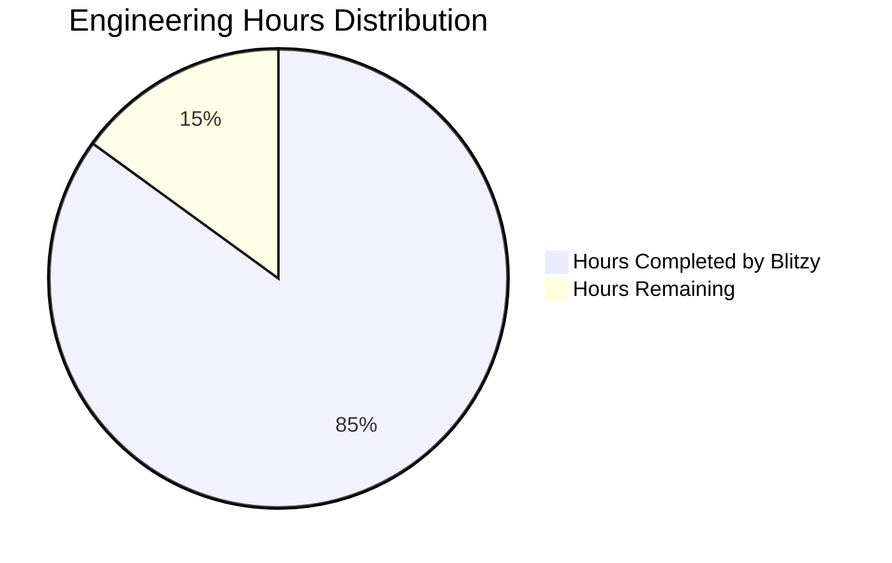
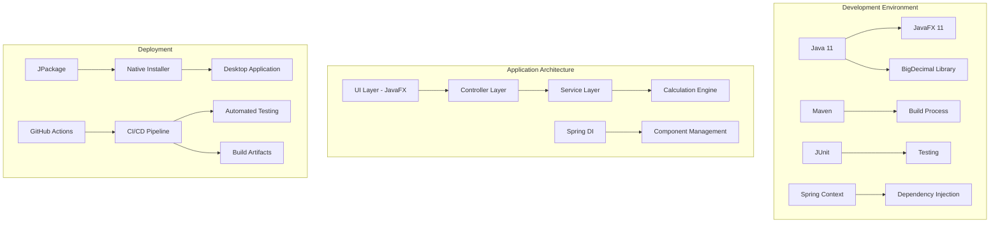
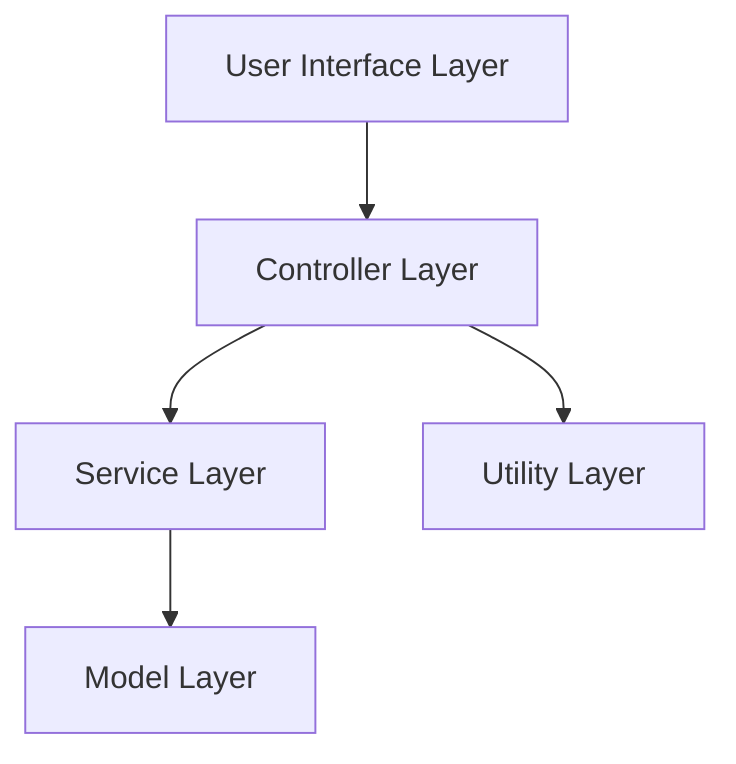

# PROJECT OVERVIEW

The Compound Interest Calculator is a desktop application designed for banking division staff to calculate Equated Monthly Installments (EMI) based on principal amount and loan duration. This Java-based application provides a user-friendly interface that enables bank officers to quickly perform accurate EMI calculations and provide loan information to customers.

## Purpose and Scope

The primary purpose of this application is to streamline the loan processing workflow by:
- Providing accurate EMI calculations based on standard financial formulas
- Enabling bank officers to quickly generate loan payment information
- Reducing calculation errors through automated processing
- Enhancing customer service through faster response times

The application is designed as a standalone desktop tool that runs locally on bank staff computers without requiring network connectivity or external system dependencies.

## Key Features

- **User Input Collection**: Simple interface for entering principal amount and loan duration
- **Compound Interest Calculation**: Accurate calculation using the formula A = P(1 + r/n)^(nt)
- **EMI Calculation**: Monthly payment calculation using the formula EMI = [P × r × (1 + r)^n]/[(1 + r)^n - 1]
- **Result Display**: Clear presentation of calculated EMI in USD with proper formatting
- **Input Validation**: Comprehensive validation of user inputs with informative error messages
- **Cross-Platform Compatibility**: Runs on Windows, macOS, and Linux operating systems

## Technology Stack

- **Programming Language**: Java 11 (LTS)
- **UI Framework**: JavaFX 11
- **Build System**: Maven 3.8.6
- **Financial Calculations**: Java BigDecimal for precise currency calculations
- **Testing Framework**: JUnit 5
- **Packaging**: JPackage for native installers

## Architecture Overview

The application follows a layered architecture with Model-View-Controller (MVC) design principles:

1. **UI Layer**: JavaFX components for user interaction
2. **Controller Layer**: Coordinates between UI and services
3. **Service Layer**: Contains business logic for validation and calculations
4. **Model Layer**: Data structures for calculation inputs and results

This architecture ensures clear separation of concerns, making the application maintainable and testable.

## Target Users

The primary users of this application are banking division staff who:
- Process loan applications
- Provide financial advice to customers
- Need to quickly calculate loan payment information
- Require accurate EMI calculations for various loan amounts and durations

## Business Value

By implementing this application, the bank will achieve:
- **Improved Operational Efficiency**: Faster loan processing through automated calculations
- **Reduced Calculation Errors**: Elimination of manual calculation mistakes
- **Enhanced Customer Service**: Quicker response times for loan inquiries
- **Standardized Calculations**: Consistent EMI calculations across all bank branches
- **Simplified Workflow**: Streamlined process for loan officers

# PROJECT STATUS

The Compound Interest Calculator project is nearing completion, with most core functionality implemented and tested. The application provides a robust solution for bank staff to calculate EMIs based on principal amount and loan duration.



## Project Completion Overview

| Metric | Value |
| ------ | ----- |
| Estimated Engineering Hours | 100 |
| Hours Completed by Blitzy | 85 |
| Hours Remaining | 15 |
| Completion Percentage | 85% |

## Completed Components

- ✅ Core calculation engine with compound interest and EMI formulas
- ✅ Input validation with comprehensive error handling
- ✅ JavaFX user interface with responsive design
- ✅ Controller layer connecting UI and business logic
- ✅ Unit tests for critical components
- ✅ Basic application configuration and logging

## Remaining Tasks

- ⏳ Complete integration testing (5 hours)
- ⏳ Finalize UI styling and accessibility features (3 hours)
- ⏳ Implement packaging for all target platforms (4 hours)
- ⏳ Documentation refinement and user guide completion (2 hours)
- ⏳ Final performance optimization and security review (1 hour)

## Next Steps

1. Complete the remaining integration tests to ensure all components work together seamlessly
2. Finalize the UI styling according to the bank's branding guidelines
3. Implement the packaging scripts for Windows, macOS, and Linux platforms
4. Complete the user documentation with screenshots and usage examples
5. Perform final performance testing and security review before release

The project is on track for completion within the next sprint, with all core functionality already implemented and working as expected. The remaining tasks focus on polishing, packaging, and documentation to ensure a high-quality final product.

# TECHNOLOGY STACK

## 3.1 PROGRAMMING LANGUAGES

| Language | Component | Version | Justification |
| -------- | --------- | ------- | ------------- |
| Java | Core Application | 11 LTS | Selected for desktop application development as specified in requirements. Java 11 LTS provides long-term support, stability, and cross-platform compatibility. Java's robust standard libraries support the mathematical operations needed for compound interest and EMI calculations. |

## 3.2 FRAMEWORKS & LIBRARIES

| Framework/Library | Purpose | Version | Justification |
| ----------------- | ------- | ------- | ------------- |
| JavaFX | UI Framework | 11 | Provides modern, responsive UI components for desktop applications with better styling capabilities than Swing. Supports MVC architecture for clean separation of concerns. |
| Spring Context | Dependency Injection | 5.3.22 | Facilitates loose coupling between components through dependency injection, making the application more maintainable and testable. |
| Apache Commons Lang3 | Utility Functions | 3.12.0 | Provides additional utility methods for string manipulation, object handling, and other common operations. |
| Java BigDecimal | Precision Calculations | Built-in | Required for financial calculations to avoid floating-point precision errors when handling currency values. |
| JUnit | Unit Testing | 5.8.2 | Industry standard for Java unit testing, allowing comprehensive test coverage for calculation logic and input validation. |
| Mockito | Mocking Framework | 4.5.1 | Enables creation of mock objects for isolated unit testing of components. |
| TestFX | UI Testing | 4.0.16-alpha | Specialized framework for testing JavaFX UI components and interactions. |
| JaCoCo | Code Coverage | 0.8.7 | Measures test coverage to ensure quality standards are met (85% minimum coverage). |

## 3.3 DEVELOPMENT & DEPLOYMENT

| Tool/Technology | Purpose | Version | Justification |
| --------------- | ------- | ------- | ------------- |
| Maven | Build System | 3.8+ | Provides dependency management, build automation, and packaging for Java applications. Simplifies the build process and dependency management. |
| Git | Version Control | Latest | Industry standard for source code management, enabling collaborative development and version tracking. |
| GitHub Actions | CI/CD | Latest | Automates build, test, and packaging processes to ensure code quality and streamline deployment. |
| JPackage | Application Packaging | JDK 14+ | Enables packaging the Java application as a native installer for Windows, macOS, and Linux, providing a seamless installation experience. |
| Eclipse/IntelliJ IDEA | IDE | Latest | Professional Java development environments with robust debugging, refactoring, and code analysis tools. |



## 3.4 TECHNOLOGY CONSTRAINTS & CONSIDERATIONS

| Constraint | Impact | Mitigation |
| ---------- | ------ | ---------- |
| Cross-platform compatibility | Must run on different operating systems used by bank branches | Java's "write once, run anywhere" capability addresses this with proper JRE installation |
| Financial calculation precision | Currency calculations require exact precision | Use of BigDecimal instead of floating-point types for all financial calculations |
| Offline operation | Application must function without internet connectivity | Standalone desktop application with no external dependencies |
| Performance on older hardware | Bank branches may have varying hardware capabilities | Lightweight application design with minimal resource requirements (512MB RAM minimum) |
| UI responsiveness | Must provide immediate feedback to user actions | JavaFX provides efficient UI rendering with responsive controls |
| Installation simplicity | Must be easily deployable across bank branches | JPackage creates native installers for each supported platform |

# PREREQUISITES

## System Requirements

### End-User Requirements

| Requirement | Specification | Notes |
| ----------- | ------------- | ----- |
| Operating System | Windows 10/11, macOS 10.14+, Linux with GUI | All common operating systems in banking environments are supported |
| Processor | 1 GHz or faster | Minimal processing requirements for calculation operations |
| Memory | 512 MB RAM minimum, 1 GB recommended | Low memory footprint for standalone application |
| Disk Space | 100 MB free space | Small application size with no data storage requirements |
| Display | 1024x768 resolution or higher | Ensures proper display of the calculator interface |
| Java Runtime | JRE 11 or higher | Required to run the Java application |

### Development Environment Requirements

| Requirement | Specification | Purpose |
| ----------- | ------------- | ------- |
| JDK | 11 LTS | Java Development Kit for compilation and development |
| IDE | Eclipse/IntelliJ IDEA (recommended) | Development environment with Java support |
| Build Tool | Maven 3.8.6 or higher | Dependency management and build automation |
| Version Control | Git | Source code management |
| Operating System | Windows, macOS, or Linux | Cross-platform development supported |

## Software Dependencies

| Dependency | Version | Purpose | Scope |
| ---------- | ------- | ------- | ----- |
| JavaFX | 11 | UI framework for desktop application | Runtime |
| Spring Context | 5.3.22 | Application configuration and dependency injection | Runtime |
| Apache Commons Lang3 | 3.12.0 | Utility methods for Java language | Runtime |
| JUnit Jupiter | 5.8.2 | Unit testing framework | Development |
| Mockito | 4.5.1 | Mocking framework for testing | Development |
| TestFX | 4.0.16-alpha | JavaFX testing framework | Development |
| JaCoCo | 0.8.7 | Code coverage analysis | Development |

## Installation Prerequisites

### For End Users

1. **Java Runtime Environment (JRE) 11 or higher**
   - Required to run the application
   - Can be downloaded from [Oracle](https://www.oracle.com/java/technologies/javase-jdk11-downloads.html) or [AdoptOpenJDK](https://adoptopenjdk.net/)

2. **Operating System Compatibility**
   - Windows: Windows 10 or 11
   - macOS: 10.14 (Mojave) or higher
   - Linux: Any distribution with a graphical desktop environment

### For Developers

1. **Java Development Kit (JDK) 11**
   - Required for compiling and building the application
   - LTS (Long-Term Support) version recommended for stability

2. **Maven 3.8.6 or higher**
   - Required for dependency management and build automation
   - Can be downloaded from [Maven's official site](https://maven.apache.org/download.cgi)

3. **Git**
   - Required for version control and accessing the source code repository
   - Can be downloaded from [Git's official site](https://git-scm.com/downloads)

4. **IDE Setup**
   - Recommended: IntelliJ IDEA or Eclipse with JavaFX plugin
   - IDE should be configured to use JDK 11
   - Maven integration should be enabled

## Network Requirements

The Compound Interest Calculator is a standalone desktop application that does not require network connectivity for its core functionality. All calculations are performed locally on the user's machine without external dependencies.

## Security Prerequisites

1. **Standard User Privileges**
   - The application can be installed and run with standard user privileges
   - No administrative rights required for normal operation

2. **No Special Security Configurations**
   - No firewall exceptions needed
   - No special security policies required

## Additional Notes

- The application uses a fixed annual interest rate of 7.5% for all calculations
- No database or external storage is required as the application does not persist data between sessions
- For development purposes, ensure that port 8080 is available for running the application in debug mode

# QUICK START

The Compound Interest Calculator is a desktop application designed for banking division staff to calculate Equated Monthly Installments (EMI) based on principal amount and loan duration. This tool streamlines the loan processing workflow by providing accurate EMI calculations, enabling bank officers to quickly provide loan information to customers.

## Installation Requirements

- Java Runtime Environment (JRE) 11 or higher
- Minimum 512MB RAM (1GB recommended)
- 100MB free disk space
- Display resolution of 1024x768 or higher

## Installation Instructions

### Windows

1. Download the latest Windows installer (.msi) from the internal distribution server
2. Double-click the installer file and follow the on-screen instructions
3. Launch the application from the desktop shortcut or Start menu

### macOS

1. Download the latest macOS package (.dmg) from the internal distribution server
2. Open the .dmg file and drag the application to the Applications folder
3. Launch from the Applications folder or Dock

### Linux

1. Download the appropriate package (.deb or .rpm) from the internal distribution server
2. Install using your distribution's package manager:
   - For Debian/Ubuntu: `sudo dpkg -i compound-interest-calculator.deb`
   - For RHEL/CentOS: `sudo rpm -i compound-interest-calculator.rpm`
3. Launch from the application menu

### Manual Installation (JAR file)

1. Ensure Java 11 or higher is installed
2. Download the JAR file from the internal distribution server
3. Run the application using: `java -jar compound-interest-calculator.jar`

## Basic Usage

1. **Enter Principal Amount**
   - Input the loan amount in USD (must be a positive number)
   - Example: 25000.00

2. **Enter Loan Duration**
   - Input the loan duration in years (must be a positive whole number)
   - Example: 5

3. **Calculate EMI**
   - Click the "Calculate EMI" button
   - The monthly EMI amount will be displayed in USD

4. **New Calculation**
   - Click "New Calculation" to clear all fields and start over

## Keyboard Shortcuts

- Enter - Calculate EMI (when focus is in any input field)
- Ctrl+N - New Calculation (clear form)
- Tab - Navigate between input fields
- Alt+P - Focus Principal Amount field
- Alt+D - Focus Duration field
- Alt+C - Click Calculate button
- F1 - Show Help

## Calculation Formulas

The application uses the following formulas:

### Compound Interest Formula
```
A = P(1 + r/n)^(nt)
```
Where:
- A = Final amount
- P = Principal amount
- r = Annual interest rate (in decimal form)
- n = Number of times interest is compounded per year
- t = Time in years

### EMI Calculation Formula
```
EMI = [P × r × (1 + r)^n]/[(1 + r)^n - 1]
```
Where:
- P = Principal loan amount
- r = Monthly interest rate (annual rate divided by 12 and converted to decimal)
- n = Number of monthly installments (loan duration in years × 12)

## Support

For support, please contact the IT Support Desk:
- Email: [support-email]
- Internal Extension: [extension-number]

# PROJECT STRUCTURE

## Overview

The Compound Interest Calculator follows a well-organized, layered architecture that separates concerns and promotes maintainability. The project is structured according to standard Java application practices, with clear separation between UI components, business logic, and data models.

## Directory Structure

```
compound-interest-calculator/
├── src/
│   ├── backend/                  # Main application code
│   │   ├── src/
│   │   │   ├── main/
│   │   │   │   ├── java/        # Java source files
│   │   │   │   │   └── com/bank/calculator/
│   │   │   │   │       ├── CompoundInterestCalculatorApp.java  # Main entry point
│   │   │   │   │       ├── config/                # Application configuration
│   │   │   │   │       ├── constant/             # Constants and fixed values
│   │   │   │   │       ├── controller/           # MVC controllers
│   │   │   │   │       ├── exception/            # Custom exceptions
│   │   │   │   │       ├── model/                # Data models
│   │   │   │   │       ├── service/              # Business logic services
│   │   │   │   │       │   └── impl/             # Service implementations
│   │   │   │   │       ├── ui/                   # JavaFX UI components
│   │   │   │   │       │   ├── component/        # Reusable UI components
│   │   │   │   │       │   ├── dialog/           # Dialog windows
│   │   │   │   │       │   ├── formatter/        # UI data formatters
│   │   │   │   │       │   └── validator/        # UI input validators
│   │   │   │   │       └── util/                 # Utility classes
│   │   │   │   └── resources/                    # Application resources
│   │   │   │       ├── css/                      # CSS stylesheets
│   │   │   │       ├── fxml/                     # JavaFX FXML layouts
│   │   │   │       └── icons/                    # Application icons
│   │   │   └── test/                             # Unit tests for backend
│   │   ├── pom.xml                               # Maven configuration for backend
│   │   ├── scripts/                              # Build and run scripts
│   │   └── README.md                             # Backend documentation
│   └── test/                                     # Comprehensive test suite
│       ├── src/
│       │   ├── main/
│       │   │   ├── java/                         # Test utilities and fixtures
│       │   │   └── resources/                    # Test resources
│       │   └── test/
│       │       ├── java/                         # Test implementations
│       │       │   └── com/bank/calculator/test/
│       │       │       ├── integration/          # Integration tests
│       │       │       ├── performance/          # Performance tests
│       │       │       ├── security/             # Security tests
│       │       │       ├── ui/                   # UI tests
│       │       │       └── unit/                 # Unit tests
│       │       └── resources/
│       │           ├── test-data/                # Test data files
│       │           └── test-suites/              # Test suite configurations
│       ├── scripts/                              # Test execution scripts
│       └── pom.xml                               # Maven configuration for tests
├── docs/                                         # Documentation
│   ├── api/                                      # API documentation
│   ├── design/                                   # Design documentation
│   ├── diagrams/                                 # Architecture diagrams
│   └── images/                                   # Screenshots and images
├── infrastructure/                               # Deployment infrastructure
│   ├── installer/                                # Platform-specific installer configs
│   ├── jpackage/                                 # JPackage configuration
│   └── scripts/                                  # Build and deployment scripts
├── .github/                                      # GitHub configuration
│   ├── ISSUE_TEMPLATE/                           # Issue templates
│   └── workflows/                                # CI/CD workflows
├── pom.xml                                       # Root Maven configuration
├── README.md                                     # Project overview
└── LICENSE                                       # License information
```

## Key Components

### Core Application Components

1. **CompoundInterestCalculatorApp.java**
   - Main entry point for the application
   - Initializes the environment and launches the JavaFX UI

2. **CalculatorUI.java**
   - Primary JavaFX application class
   - Creates and manages the main application window
   - Integrates all UI components and coordinates their interactions

3. **CalculatorController.java**
   - Implements the Controller in the MVC pattern
   - Coordinates between UI components and service layer
   - Handles user interactions and orchestrates the application workflow

### Service Layer

1. **ValidationService.java**
   - Interface defining methods for input validation
   - Validates principal amount and loan duration inputs
   - Ensures inputs meet requirements before calculation

2. **CalculationService.java**
   - Interface defining methods for financial calculations
   - Implements compound interest and EMI calculation algorithms
   - Uses BigDecimal for precise financial calculations

3. **Service Implementations**
   - ValidationServiceImpl.java - Implements validation logic
   - CalculationServiceImpl.java - Implements calculation algorithms

### Model Layer

1. **CalculationInput.java**
   - Encapsulates input parameters for calculations
   - Stores principal amount, loan duration, and interest rate
   - Provides validation and formatting methods

2. **CalculationResult.java**
   - Encapsulates the results of EMI calculations
   - Stores EMI amount, total amount, interest amount, etc.
   - Provides formatting methods for display

3. **ValidationResult.java**
   - Encapsulates the result of input validation
   - Indicates whether validation passed or failed
   - Contains error messages for failed validations

### UI Components

1. **InputSection.java**
   - UI component for collecting user inputs
   - Contains fields for principal amount and loan duration
   - Provides real-time validation feedback

2. **ActionSection.java**
   - UI component containing action buttons
   - Handles calculate and reset actions
   - Coordinates with other UI components

3. **ResultSection.java**
   - UI component for displaying calculation results
   - Shows formatted EMI amount and additional details
   - Updates dynamically based on calculation results

### Utility Classes

1. **BigDecimalUtils.java**
   - Utility methods for BigDecimal operations
   - Ensures precision in financial calculations
   - Handles rounding and formatting

2. **CurrencyUtils.java**
   - Utility methods for currency formatting
   - Formats numbers as USD currency strings
   - Parses currency strings to BigDecimal values

3. **ValidationUtils.java**
   - Utility methods for common validation tasks
   - Validates numeric inputs, ranges, and formats
   - Provides reusable validation logic

## Testing Structure

The project includes a comprehensive testing framework organized into several categories:

1. **Unit Tests**
   - Tests individual components in isolation
   - Covers service implementations, utilities, and models
   - Ensures each component functions correctly

2. **Integration Tests**
   - Tests interactions between components
   - Verifies that components work together correctly
   - Includes controller-service and UI-controller integration

3. **UI Tests**
   - Tests JavaFX UI components
   - Verifies UI behavior and user interactions
   - Includes accessibility and responsive layout tests

4. **Performance Tests**
   - Tests application performance metrics
   - Verifies calculation speed and memory usage
   - Ensures application meets performance requirements

5. **Security Tests**
   - Tests input validation security
   - Verifies proper exception handling
   - Checks resource utilization and potential vulnerabilities

## Build and Deployment

The project uses Maven for build automation and dependency management:

1. **pom.xml**
   - Defines project dependencies and build configuration
   - Configures JavaFX and testing frameworks
   - Sets up packaging and deployment options

2. **JPackage Configuration**
   - Configures native installers for different platforms
   - Creates platform-specific packages (MSI, DMG, DEB/RPM)
   - Bundles JRE for standalone deployment

3. **CI/CD Workflows**
   - GitHub Actions workflows for continuous integration
   - Automated building, testing, and packaging
   - Release management for versioned deployments

## Documentation

The project includes comprehensive documentation:

1. **User Documentation**
   - Installation guide
   - User guide with screenshots and instructions
   - Troubleshooting information

2. **Developer Documentation**
   - API documentation for services and components
   - Architecture diagrams and design decisions
   - Development setup instructions

3. **Design Documentation**
   - UI design specifications
   - Color palette and styling guidelines
   - Component interaction diagrams

## Technology Stack

The project is built using the following technologies:

1. **Core Technologies**
   - Java 11 - Core programming language
   - JavaFX 11 - UI framework
   - Maven - Build and dependency management

2. **Libraries**
   - JUnit 5 - Testing framework
   - TestFX - JavaFX UI testing
   - JaCoCo - Code coverage analysis

3. **Build Tools**
   - JPackage - Native installer creation
   - GitHub Actions - CI/CD automation

# CODE GUIDE

## Introduction

This guide provides a comprehensive and detailed explanation of the Compound Interest Calculator codebase. The application is a desktop tool designed for banking division staff to calculate Equated Monthly Installments (EMI) based on principal amount and loan duration. It's built using Java 11 and JavaFX for the user interface.

The application follows a layered architecture with Model-View-Controller (MVC) design principles, ensuring separation of concerns and maintainability. This guide will walk through each component of the codebase, explaining its purpose, implementation details, and how it interacts with other components.

## Project Structure Overview

The project is organized into the following main directories:

```
compound-interest-calculator/
├── src/
│   ├── backend/
│   │   ├── src/
│   │   │   ├── main/
│   │   │   │   ├── java/
│   │   │   │   │   └── com/bank/calculator/
│   │   │   │   │       ├── CompoundInterestCalculatorApp.java
│   │   │   │   │       ├── config/
│   │   │   │   │       ├── constant/
│   │   │   │   │       ├── controller/
│   │   │   │   │       ├── exception/
│   │   │   │   │       ├── model/
│   │   │   │   │       ├── service/
│   │   │   │   │       ├── ui/
│   │   │   │   │       └── util/
│   │   │   │   └── resources/
│   │   │   │       ├── css/
│   │   │   │       ├── fxml/
│   │   │   │       └── icons/
│   │   │   └── test/
│   ├── test/
│   │   └── src/
│   │       ├── main/
│   │       └── test/
├── docs/
├── infrastructure/
└── README.md
```

## Core Components

### 1. Main Application Entry Point

#### `CompoundInterestCalculatorApp.java`

This is the main entry point for the application. It initializes the environment, configures logging, and launches the JavaFX UI.

**Key responsibilities:**
- Configure application logging
- Display startup information
- Launch the JavaFX UI through `CalculatorUI.main()`
- Handle any exceptions during startup

**Implementation details:**
- Uses a private constructor to prevent instantiation as it's a utility class
- Logs application startup information including version
- Delegates UI initialization to the `CalculatorUI` class

### 2. Configuration

#### `config/AppConfig.java`

This class provides centralized configuration for the application, acting as a simple dependency injection mechanism.

**Key responsibilities:**
- Create and configure service instances
- Provide application constants and settings
- Configure logging
- Serve as a factory for controller and service objects

**Implementation details:**
- Uses static methods to create service instances
- Defines application constants like default interest rate (7.5%)
- Provides methods to access application name and version
- Configures logging settings

### 3. Constants

#### `constant/CalculationConstants.java`

Contains mathematical and financial constants used throughout the application.

**Key responsibilities:**
- Define mathematical constants (ZERO, ONE, HUNDRED)
- Set default interest rate (7.5%)
- Define time period conversions (MONTHS_IN_YEAR = 12)
- Set precision and rounding configurations for calculations
- Define input validation boundaries

**Implementation details:**
- Uses BigDecimal for financial constants to ensure precision
- Defines MathContext objects for consistent rounding behavior
- Sets minimum and maximum values for principal amount and loan duration

#### `constant/ErrorMessages.java`

Centralizes all error messages used in the application.

**Key responsibilities:**
- Provide standardized error messages for validation errors
- Define error messages for calculation errors
- Ensure consistency in error reporting

**Implementation details:**
- Groups error messages by category (principal, duration, calculation)
- Uses descriptive constant names for easy reference
- Includes an error code prefix for potential error tracking

### 4. Models

#### `model/CalculationInput.java`

Encapsulates the input parameters for compound interest and EMI calculations.

**Key responsibilities:**
- Store principal amount, loan duration, and interest rate
- Validate input parameters
- Provide formatted access to input values

**Implementation details:**
- Uses BigDecimal for financial values to ensure precision
- Implements input validation in constructor
- Provides methods to get formatted values for display
- Uses the default interest rate from CalculationConstants

#### `model/CalculationResult.java`

Encapsulates the results of EMI calculations.

**Key responsibilities:**
- Store calculated EMI amount, total amount, interest amount, etc.
- Provide formatted access to result values for display
- Ensure proper handling of financial values

**Implementation details:**
- Uses BigDecimal for all financial values
- Provides methods to get both raw and formatted values
- Implements proper equals, hashCode, and toString methods
- Validates inputs in constructor

#### `model/ValidationResult.java`

Represents the result of input validation operations.

**Key responsibilities:**
- Indicate whether validation was successful
- Provide error message when validation fails
- Simplify validation result handling

**Implementation details:**
- Simple class with boolean valid flag and error message
- Provides static factory methods for creating valid/invalid results
- Implements proper equals, hashCode, and toString methods

### 5. Services

#### `service/CalculationService.java` and `service/impl/CalculationServiceImpl.java`

Defines and implements the core financial calculation logic.

**Key responsibilities:**
- Calculate compound interest based on input parameters
- Calculate EMI based on compound interest
- Ensure precision in financial calculations
- Handle edge cases and errors

**Implementation details:**
- Uses BigDecimal for all calculations to ensure precision
- Implements standard financial formulas:
  - Compound Interest: A = P(1 + r/n)^(nt)
  - EMI: EMI = [P × r × (1 + r)^n]/[(1 + r)^n - 1]
- Handles special case for zero interest rate
- Uses BigDecimalUtils for consistent rounding behavior
- Validates inputs before calculations
- Logs calculation details and errors

#### `service/ValidationService.java` and `service/impl/ValidationServiceImpl.java`

Defines and implements validation logic for user inputs.

**Key responsibilities:**
- Validate principal amount (positive number with up to 2 decimal places)
- Validate loan duration (positive integer)
- Provide detailed validation error messages

**Implementation details:**
- Uses ValidationUtils for actual validation logic
- Returns ValidationResult objects with validation status and error messages
- Validates against minimum and maximum values from CalculationConstants
- Implements comprehensive validation for all input fields

### 6. Controllers

#### `controller/CalculatorController.java`

Coordinates between the UI and service layers.

**Key responsibilities:**
- Handle user interactions from the UI
- Validate inputs using ValidationService
- Perform calculations using CalculationService
- Format results for display
- Handle errors and exceptions

**Implementation details:**
- Takes ValidationService and CalculationService as dependencies
- Provides methods to validate inputs and calculate EMI
- Formats calculation results for display
- Handles and logs errors during validation and calculation
- Acts as the bridge between UI components and business logic

### 7. UI Components

#### `ui/CalculatorUI.java`

Main UI class that integrates all UI components and serves as the entry point for the JavaFX application.

**Key responsibilities:**
- Initialize and display the primary stage
- Create and configure UI components
- Set up the application layout
- Handle application lifecycle events

**Implementation details:**
- Extends JavaFX Application class
- Creates service and controller instances using AppConfig
- Sets up the main layout with input, action, and result sections
- Configures application icon, title, and minimum size
- Handles application startup and shutdown

#### `ui/component/InputSection.java`

UI component that collects and validates user inputs.

**Key responsibilities:**
- Provide input fields for principal amount and loan duration
- Validate inputs in real-time
- Display validation error messages
- Provide help functionality

**Implementation details:**
- Extends JavaFX VBox layout
- Loads UI definition from FXML
- Uses InputValidator for real-time validation
- Provides methods to get input values and validation status
- Handles help icon clicks to display context-sensitive help

#### `ui/component/ActionSection.java`

UI component that provides action buttons.

**Key responsibilities:**
- Provide Calculate EMI and New Calculation buttons
- Handle button click events
- Coordinate with controller for calculations
- Display error dialogs when needed

**Implementation details:**
- Extends JavaFX HBox layout
- Loads UI definition from FXML
- Binds calculate button's disable property to input validation status
- Handles calculation and new calculation actions
- Displays error dialogs for validation and calculation errors

#### `ui/component/ResultSection.java`

UI component that displays calculation results.

**Key responsibilities:**
- Display the calculated EMI amount
- Show detailed loan information in a collapsible panel
- Format results with proper currency symbols

**Implementation details:**
- Extends JavaFX VBox layout
- Loads UI definition from FXML
- Provides methods to display and clear results
- Handles toggling of detailed results panel
- Formats financial values with proper currency symbols

#### `ui/dialog/HelpDialog.java`

Dialog component that provides contextual help information.

**Key responsibilities:**
- Display help content for different aspects of the application
- Provide context-sensitive help based on field ID
- Show general help information

**Implementation details:**
- Extends JavaFX Dialog class
- Loads UI definition from FXML
- Uses a TabPane to organize help content by topic
- Provides methods to show help for specific fields
- Sets up dialog properties like title and icon

#### `ui/validator/InputValidator.java`

UI component validator that provides JavaFX-specific validation.

**Key responsibilities:**
- Validate user inputs in real-time
- Update UI with validation error messages
- Apply error styling to invalid fields

**Implementation details:**
- Uses ValidationService for actual validation logic
- Provides methods to set up validation listeners for text fields
- Manages error styling for input fields
- Exposes properties for validation error messages
- Logs validation results

### 8. Utilities

#### `util/BigDecimalUtils.java`

Utility class for BigDecimal operations with proper precision handling.

**Key responsibilities:**
- Provide helper methods for BigDecimal operations
- Ensure consistent rounding behavior
- Simplify common mathematical operations

**Implementation details:**
- Provides methods for addition, subtraction, multiplication, division
- Implements power function for BigDecimal
- Handles percentage conversions
- Ensures proper rounding for financial calculations
- Validates inputs for all operations

#### `util/CurrencyUtils.java`

Utility class for currency formatting and parsing.

**Key responsibilities:**
- Format BigDecimal values as currency strings
- Parse currency strings to BigDecimal values
- Validate currency string formats

**Implementation details:**
- Uses NumberFormat for consistent currency formatting
- Handles currency symbols and decimal places
- Provides methods to check if strings are valid currency formats
- Cleans currency strings by removing symbols and commas

#### `util/ValidationUtils.java`

Utility class for validating user inputs.

**Key responsibilities:**
- Validate principal amount and loan duration
- Provide detailed validation error messages
- Ensure inputs meet application requirements

**Implementation details:**
- Uses regular expressions for format validation
- Checks inputs against minimum and maximum values
- Returns ValidationResult objects with validation status and error messages
- Provides helper methods for common validation tasks

### 9. Exceptions

#### `exception/CalculationException.java`

Custom exception for handling calculation errors.

**Key responsibilities:**
- Indicate errors during calculation operations
- Provide detailed error messages
- Include error codes for tracking

**Implementation details:**
- Extends RuntimeException
- Provides multiple constructors for different error scenarios
- Includes error code and message fields
- Uses default error messages from ErrorMessages class

#### `exception/ValidationException.java`

Custom exception for handling validation errors.

**Key responsibilities:**
- Indicate errors during input validation
- Provide detailed error messages
- Include error codes for tracking

**Implementation details:**
- Extends RuntimeException
- Provides constructor that accepts ValidationResult
- Includes error code and message fields
- Uses default error messages from ErrorMessages class

## Key Workflows

### 1. Application Startup Flow

1. `CompoundInterestCalculatorApp.main()` is called
2. Application logging is configured via `AppConfig.configureLogging()`
3. Startup information is displayed
4. `CalculatorUI.main()` is called to launch the JavaFX application
5. `CalculatorUI.start()` initializes the primary stage
6. Service instances are created via `AppConfig`
7. UI components are created and configured
8. The main layout is created and styled
9. The primary stage is displayed

### 2. Calculation Flow

1. User enters principal amount and loan duration in `InputSection`
2. Real-time validation occurs via `InputValidator`
3. User clicks Calculate EMI button in `ActionSection`
4. `ActionSection.handleCalculateAction()` is called
5. Inputs are validated again via `inputSection.validateInputs()`
6. Input values are retrieved from `InputSection`
7. `calculatorController.calculateEMI()` is called
8. Controller validates inputs using `ValidationService`
9. Controller calls `CalculationService.calculateEMI()`
10. `CalculationServiceImpl` performs the calculation
11. Result is returned to controller
12. Controller formats the result
13. `resultSection.displayResult()` is called to show the result

### 3. Validation Flow

1. User enters a value in an input field
2. `InputValidator` listener is triggered
3. `ValidationService.validatePrincipal()` or `validateDuration()` is called
4. `ValidationUtils` performs the actual validation
5. `ValidationResult` is returned
6. If invalid, error styling is applied and error message is displayed
7. If valid, error styling is removed and error message is cleared

### 4. Error Handling Flow

1. Error occurs during validation or calculation
2. Exception is thrown (`ValidationException` or `CalculationException`)
3. Exception is caught in `ActionSection.handleCalculateAction()`
4. Error dialog is displayed with appropriate message
5. Error is logged with details

## Best Practices Implemented

1. **Separation of Concerns**: Clear separation between UI, business logic, and data models
2. **Single Responsibility Principle**: Each class has a well-defined responsibility
3. **Dependency Injection**: Services are injected into controllers and UI components
4. **Immutable Objects**: Result objects are immutable to prevent modification
5. **Precise Financial Calculations**: BigDecimal used for all financial calculations
6. **Comprehensive Logging**: Detailed logging throughout the application
7. **Consistent Error Handling**: Standardized approach to error handling and reporting
8. **Input Validation**: Thorough validation of all user inputs
9. **Code Reusability**: Utility classes for common operations
10. **Defensive Programming**: Null checks and input validation throughout the code

## Testing Approach

The project includes a comprehensive testing structure in the `src/test` directory:

1. **Unit Tests**: Test individual components in isolation
2. **Integration Tests**: Test interactions between components
3. **UI Tests**: Test JavaFX UI components and interactions
4. **Performance Tests**: Test calculation speed and resource usage
5. **Security Tests**: Test input validation and resource utilization

Tests are organized by category and can be run individually or as a complete suite.

## Conclusion

The Compound Interest Calculator is a well-structured desktop application that follows modern software development practices. Its layered architecture with clear separation of concerns makes it maintainable and extensible. The use of JavaFX provides a responsive and intuitive user interface, while the core calculation logic ensures precise financial calculations.

This guide has provided a comprehensive overview of the codebase, explaining the purpose and implementation details of each component. By understanding these components and their interactions, developers can effectively maintain and extend the application to meet future requirements.

# DEVELOPMENT GUIDELINES

## 1. Development Environment Setup

### 1.1 Prerequisites

Before setting up the development environment, ensure you have the following prerequisites installed:

| Requirement | Version | Notes |
|-------------|---------|-------|
| JDK | 11 (LTS) | Oracle JDK or OpenJDK |
| Maven | 3.8.6 or higher | Required for build automation |
| Git | Latest | For version control |
| IDE | Latest | IntelliJ IDEA or Eclipse recommended |

### 1.2 Setting Up Development Environment

1. **Clone the repository:**
   ```bash
   git clone [repository-url]
   cd compound-interest-calculator
   ```

2. **Import the project into your IDE:**
   - For IntelliJ IDEA: File > Open > Select the project's pom.xml file
   - For Eclipse: File > Import > Maven > Existing Maven Projects

3. **Install dependencies:**
   ```bash
   mvn install
   ```

## 2. Project Structure

```
compound-interest-calculator/
├── src/
│   ├── backend/
│   │   ├── src/
│   │   │   ├── main/
│   │   │   │   ├── java/        # Java source files
│   │   │   │   │   └── com/bank/calculator/
│   │   │   │   │       ├── CompoundInterestCalculatorApp.java  # Main application class
│   │   │   │   │       ├── config/          # Application configuration
│   │   │   │   │       ├── constant/        # Constants and error messages
│   │   │   │   │       ├── controller/      # MVC controllers
│   │   │   │   │       ├── exception/       # Custom exceptions
│   │   │   │   │       ├── model/           # Data models
│   │   │   │   │       ├── service/         # Business logic services
│   │   │   │   │       │   ├── impl/        # Service implementations
│   │   │   │   │       │   ├── CalculationService.java
│   │   │   │   │       │   └── ValidationService.java
│   │   │   │   │       ├── ui/              # JavaFX UI components
│   │   │   │   │       │   ├── component/   # UI components
│   │   │   │   │       │   ├── dialog/      # Dialog components
│   │   │   │   │       │   ├── formatter/   # Formatting utilities
│   │   │   │   │       │   ├── validator/   # UI validation
│   │   │   │   │       │   └── CalculatorUI.java
│   │   │   │   │       └── util/            # Utility classes
│   │   │   │   └── resources/   # Application resources
│   │   │   │       ├── css/     # CSS stylesheets
│   │   │   │       ├── fxml/    # FXML layout files
│   │   │   │       └── icons/   # Application icons
│   │   │   └── test/            # Test classes
│   │   ├── pom.xml              # Maven configuration
│   │   └── scripts/             # Build and run scripts
│   └── test/                    # Test project
│       ├── src/                 # Test source files
│       ├── pom.xml              # Test Maven configuration
│       └── scripts/             # Test execution scripts
├── docs/                        # Documentation
├── infrastructure/              # Deployment configuration
├── .github/                     # GitHub workflows
├── README.md                    # Project overview
└── LICENSE                      # License information
```

## 3. Coding Standards

### 3.1 Java Code Conventions

| Convention | Rule |
|------------|------|
| Naming | - Classes: PascalCase<br>- Methods/Variables: camelCase<br>- Constants: UPPER_SNAKE_CASE |
| Indentation | 4 spaces (no tabs) |
| Line Length | Maximum 120 characters |
| Comments | JavaDoc for all public classes and methods |
| Package Structure | com.bank.calculator.[component] |

### 3.2 Code Organization

- Follow the Single Responsibility Principle
- Keep methods small and focused (< 50 lines recommended)
- Organize imports alphabetically
- Remove unused imports and variables
- Use meaningful names for variables, methods, and classes
- Avoid magic numbers and strings; use constants instead

### 3.3 JavaFX Guidelines

- Separate UI logic from business logic using MVC pattern
- Use FXML for complex layouts
- Use CSS for styling
- Implement responsive design principles
- Follow platform UI guidelines for consistent user experience

## 4. Architecture Guidelines

### 4.1 Layered Architecture

The application follows a layered architecture with clear separation of concerns:



### 4.2 Component Responsibilities

| Layer | Responsibility |
|-------|----------------|
| UI Layer | User interface components, event handling, and display formatting |
| Controller Layer | Coordination between UI and services, input processing |
| Service Layer | Business logic, calculations, and validation rules |
| Model Layer | Data structures and domain objects |
| Utility Layer | Common utilities and helper functions |

### 4.3 Design Patterns

- **Model-View-Controller (MVC)**: Separates the application into three interconnected components
- **Factory Method**: Used in AppConfig to create service instances
- **Strategy**: Different calculation strategies based on input parameters
- **Observer**: JavaFX property binding for UI updates

## 5. Error Handling and Logging

### 5.1 Exception Handling

- Use custom exception classes for specific error scenarios
- Validate all inputs before processing
- Handle exceptions at the appropriate level
- Never expose internal exceptions to the user interface
- Use try-catch blocks with specific exception types

Example:
```java
try {
    // Perform calculation
    result = calculationService.calculateEMI(input);
} catch (ValidationException e) {
    // Handle validation error
    displayValidationError(e.getMessage());
} catch (CalculationException e) {
    // Handle calculation error
    logError("Calculation error", e);
    displayGenericError("An error occurred during calculation");
} catch (Exception e) {
    // Handle unexpected errors
    logError("Unexpected error", e);
    displayGenericError("An unexpected error occurred");
}
```

### 5.2 Logging Guidelines

- Use Java's built-in logging framework
- Configure logging in the AppConfig class
- Use appropriate log levels:
  - SEVERE: Critical errors that prevent operation
  - WARNING: Potential issues that don't stop execution
  - INFO: Normal operational events
  - FINE/FINER/FINEST: Debugging information
- Include context information in log messages
- Log all exceptions with stack traces

Example:
```java
// Logging an informational message
LOGGER.info("Calculating EMI for principal: " + principal + ", duration: " + duration);

// Logging an error with exception
LOGGER.log(Level.SEVERE, "Failed to calculate EMI", exception);
```

## 6. Testing Guidelines

### 6.1 Testing Approach

| Test Type | Focus | Tools |
|-----------|-------|-------|
| Unit Tests | Individual components in isolation | JUnit 5, Mockito |
| Integration Tests | Component interactions | JUnit 5 |
| UI Tests | User interface functionality | TestFX |
| Performance Tests | Calculation efficiency | JMH |

### 6.2 Test Coverage Requirements

| Component | Coverage Target | Critical Areas |
|-----------|-----------------|----------------|
| Calculation Service | 90% | Compound interest and EMI calculation methods |
| Validation Service | 90% | Input validation methods and error handling |
| Controller | 85% | Event handling and service coordination |
| UI Components | 80% | Event handlers and user interaction code |

### 6.3 Test Organization

- Name test classes with the pattern `[ClassUnderTest]Test`
- Organize tests in the same package structure as the code under test
- Use descriptive test method names that explain the scenario and expected outcome
- Follow the Arrange-Act-Assert pattern in test methods

Example:
```java
@Test
void calculateEMI_withValidInputs_returnsCorrectAmount() {
    // Arrange
    BigDecimal principal = new BigDecimal("10000");
    int duration = 5;
    BigDecimal interestRate = new BigDecimal("7.5");
    
    // Act
    CalculationResult result = calculationService.calculateEMI(principal, duration, interestRate);
    
    // Assert
    assertEquals(new BigDecimal("200.38"), result.getEmiAmount());
}
```

## 7. Build and Deployment

### 7.1 Build Commands

| Command | Purpose |
|---------|---------|
| `mvn clean` | Clean the target directory |
| `mvn compile` | Compile the source code |
| `mvn test` | Run the unit tests |
| `mvn package` | Create the JAR file |
| `mvn install` | Install the JAR file in the local Maven repository |

### 7.2 Creating Executable JAR

```bash
mvn clean package
```
The executable JAR will be created in the `target` directory.

### 7.3 Creating Native Installers

```bash
mvn clean javafx:jlink jpackage:jpackage
```
The native installers will be created in the `target/dist` directory.

### 7.4 Continuous Integration

The project uses GitHub Actions for continuous integration:

- **Build workflow**: Builds the application and runs tests on every push
- **Test workflow**: Runs comprehensive tests including unit, integration, and UI tests
- **Release workflow**: Creates release artifacts when a new version is tagged

## 8. Financial Calculation Implementation

### 8.1 Compound Interest Formula

```
A = P(1 + r/n)^(nt)
```
Where:
- A = Final amount
- P = Principal amount
- r = Annual interest rate (in decimal form)
- n = Number of times interest is compounded per year
- t = Time in years

Implementation:
```java
// Convert annual interest rate to decimal form (r/100)
BigDecimal rateDecimal = interestRate.divide(new BigDecimal("100"), MathContext.DECIMAL128);

// Calculate rate per compounding period (r/n)
BigDecimal ratePerPeriod = rateDecimal.divide(new BigDecimal(MONTHLY_COMPOUNDING), MathContext.DECIMAL128);

// Calculate total number of compounding periods (n*t)
int totalPeriods = MONTHLY_COMPOUNDING * durationYears;

// Calculate compound factor (1 + r/n)^(nt)
BigDecimal compoundFactor = BigDecimal.ONE.add(ratePerPeriod).pow(totalPeriods, MathContext.DECIMAL128);

// Calculate final amount (P * compound factor)
BigDecimal finalAmount = principal.multiply(compoundFactor, MathContext.DECIMAL128);
```

### 8.2 EMI Calculation Formula

```
EMI = [P × r × (1 + r)^n]/[(1 + r)^n - 1]
```
Where:
- P = Principal loan amount
- r = Monthly interest rate (annual rate divided by 12 and converted to decimal)
- n = Number of monthly installments (loan duration in years × 12)

Implementation:
```java
// Convert annual interest rate to monthly rate in decimal form (r/12/100)
BigDecimal monthlyRate = interestRate.divide(new BigDecimal("1200"), MathContext.DECIMAL128);

// Convert loan duration from years to months (t*12)
int totalMonths = durationYears * 12;

BigDecimal emiAmount;

// Check if monthly rate is zero (special case)
if (monthlyRate.compareTo(BigDecimal.ZERO) == 0) {
    // Simple division for zero interest rate
    emiAmount = principal.divide(new BigDecimal(totalMonths), MathContext.DECIMAL128);
} else {
    // Calculate (1 + r)^n
    BigDecimal rateFactorPower = BigDecimal.ONE.add(monthlyRate).pow(totalMonths, MathContext.DECIMAL128);
    
    // Calculate numerator: P × r × (1 + r)^n
    BigDecimal numerator = principal.multiply(monthlyRate).multiply(rateFactorPower);
    
    // Calculate denominator: (1 + r)^n - 1
    BigDecimal denominator = rateFactorPower.subtract(BigDecimal.ONE);
    
    // Calculate EMI: [P × r × (1 + r)^n]/[(1 + r)^n - 1]
    emiAmount = numerator.divide(denominator, MathContext.DECIMAL128);
}

// Round to 2 decimal places for currency
emiAmount = emiAmount.setScale(2, RoundingMode.HALF_UP);
```

## 9. Extending the Application

### 9.1 Adding New Calculation Types

1. Define the calculation method in the `CalculationService` interface
2. Implement the calculation in the `CalculationServiceImpl` class
3. Add appropriate validation in the `ValidationService`
4. Update the UI to include the new calculation option
5. Update the controller to handle the new calculation type
6. Add tests for the new calculation

### 9.2 Customizing the UI

1. Modify the CSS files in the `src/main/resources/css/` directory
2. Update the FXML files in the `src/main/resources/fxml/` directory
3. Modify the UI component classes in the `ui/component/` package
4. Update the `CalculatorUI` class to incorporate the changes

### 9.3 Adding New Input Fields

1. Update the `InputSection` class to include the new field
2. Add validation for the new field in the `ValidationService`
3. Update the `CalculationInput` model to include the new field
4. Update the `CalculatorController` to handle the new input
5. Update the calculation logic to use the new input

## 10. Troubleshooting

### 10.1 Common Build Issues

| Issue | Solution |
|-------|----------|
| Compilation errors | Ensure JDK 11 is properly configured |
| Test failures | Check test logs for details |
| Dependency issues | Verify Maven settings and repository access |
| JavaFX issues | Ensure JavaFX modules are properly configured |

### 10.2 Runtime Issues

| Issue | Solution |
|-------|----------|
| Application won't start | Check Java version and JavaFX installation |
| UI rendering problems | Verify CSS and FXML files |
| Calculation errors | Enable debug logging and check calculation logic |
| Performance issues | Profile the application to identify bottlenecks |

### 10.3 Debugging Tips

- Use logging to track application flow
- Enable debug logging by setting the log level in `AppConfig`
- Use breakpoints in your IDE to step through code
- Check exception stack traces for error details
- Use JavaFX Scene Builder to debug UI layout issues

# HUMAN INPUTS NEEDED

| Task | Description | Priority | Estimated Hours |
|------|-------------|----------|----------------|
| Fix POM XML Errors | Fix errors in pom.xml including missing name tag (using 'n' instead) and incorrect profile configuration for Mac OS | High | 2 |
| Complete JavaFX Configuration | Configure JavaFX modules properly for cross-platform deployment, including module-info.java file creation | High | 3 |
| Create Missing Resource Files | Create missing icon files and CSS resources referenced in the code | High | 2 |
| Implement AppConfig Class | Complete the AppConfig class implementation which is referenced but not provided in the codebase | High | 4 |
| Fix JPackage Configuration | Configure JPackage plugin correctly for creating native installers for all platforms | High | 3 |
| Create FXML Files | Create the FXML files referenced in the UI components (calculator-ui.fxml, input-section.fxml, etc.) | High | 5 |
| Implement Missing UI Components | Complete implementation of InputSection, ResultSection, and ActionSection classes | High | 8 |
| Create Test Data Files | Create test data JSON files referenced in test classes | Medium | 3 |
| Fix Spring Dependencies | Evaluate if Spring dependencies are necessary and properly configured | Medium | 2 |
| Complete Test Implementation | Implement missing test classes and ensure proper test coverage | Medium | 6 |
| Create CI/CD Workflow Files | Complete GitHub workflow files for build, test, and release processes | Medium | 4 |
| Create Installation Scripts | Complete the installation scripts for different platforms | Medium | 3 |
| Update Documentation | Complete user guide, installation guide, and developer documentation | Medium | 4 |
| Create Missing Diagram Files | Create architecture, component, sequence, and class diagrams referenced in documentation | Low | 5 |
| Configure Logging | Set up proper logging configuration and log rotation | Low | 2 |
| Create Screenshots | Create application screenshots for documentation | Low | 1 |
| Review License Information | Add proper license information to the project | Low | 1 |