# Technical Specifications

## 1. INTRODUCTION

### EXECUTIVE SUMMARY

The Compound Interest Calculator is a desktop application designed for the banking division to calculate Equated Monthly Installments (EMI) based on principal amount and loan duration. This tool will streamline the loan processing workflow by providing accurate EMI calculations, enabling bank officers to quickly provide loan information to customers. The primary stakeholders include the banking division staff who process loans and provide financial advice to customers. By implementing this application, the bank expects to improve operational efficiency, reduce calculation errors, and enhance customer service through faster response times.

### SYSTEM OVERVIEW

#### Project Context
| Aspect | Description |
| ------ | ----------- |
| Business Context | The application will be used within the banking division's loan processing workflow to provide accurate EMI calculations for various loan products. |
| Current Limitations | Current manual calculations or spreadsheet-based solutions may be prone to human error and inconsistency across different bank branches. |
| Enterprise Integration | The application will function as a standalone tool within the banking ecosystem, with potential for future integration with the bank's core lending platform. |

#### High-Level Description
| Component | Description |
| --------- | ----------- |
| Primary Capabilities | Calculate compound interest and EMI based on principal amount and loan duration in years. |
| Major Components | User interface for input collection, calculation engine, and results display. |
| Technical Approach | Java-based desktop application with a simple, intuitive user interface for data entry and results presentation. |

#### Success Criteria
| Criteria Type | Description |
| ------------- | ----------- |
| Measurable Objectives | 100% calculation accuracy, user input validation, and clear presentation of EMI results in USD. |
| Critical Success Factors | Intuitive user interface, accurate calculations, and reliable performance across all supported operating systems. |
| Key Performance Indicators | Reduction in loan processing time, decrease in calculation errors, and positive user feedback from banking staff. |

### SCOPE

#### In-Scope:

**Core Features and Functionalities**
| Feature | Description |
| ------- | ----------- |
| Input Collection | User interface to collect principal amount in USD and loan duration in years. |
| Calculation Engine | Backend logic to calculate compound interest and convert to monthly EMI. |
| Result Presentation | Display of calculated EMI amount in USD with appropriate formatting. |
| Input Validation | Validation of user inputs to ensure they are within acceptable ranges and formats. |

**Implementation Boundaries**
| Boundary | Description |
| -------- | ----------- |
| System Boundaries | Standalone desktop application without external system dependencies. |
| User Groups | Banking division staff responsible for loan processing and customer consultations. |
| Geographic Coverage | All bank branches where loan processing occurs. |
| Data Domains | Financial calculation data limited to principal amount and loan duration. |

#### Out-of-Scope:
- Integration with the bank's core banking system or customer relationship management (CRM) systems
- Saving or retrieving calculation history
- User authentication and authorization features
- Support for multiple currencies beyond USD
- Mobile or web-based versions of the application
- Advanced loan features such as variable interest rates, prepayment options, or balloon payments
- Printing or exporting calculation results to external formats
- Customer-facing deployment of the application

## 2. PRODUCT REQUIREMENTS

### 2.1 FEATURE CATALOG

#### 2.1.1 User Input Collection

| Metadata | Details |
| -------- | ------- |
| Feature ID | F-001 |
| Feature Name | User Input Collection |
| Feature Category | User Interface |
| Priority Level | Critical |
| Status | Approved |

**Description**
| Aspect | Details |
| ------ | ------- |
| Overview | Interface for users to input principal amount and loan duration |
| Business Value | Enables bank staff to quickly enter loan parameters |
| User Benefits | Simple, intuitive data entry process for loan calculations |
| Technical Context | Forms the foundation for the calculation engine |

**Dependencies**
| Type | Details |
| ---- | ------- |
| Prerequisite Features | None |
| System Dependencies | Java Runtime Environment |
| External Dependencies | None |
| Integration Requirements | None |

#### 2.1.2 Compound Interest Calculation

| Metadata | Details |
| -------- | ------- |
| Feature ID | F-002 |
| Feature Name | Compound Interest Calculation |
| Feature Category | Core Functionality |
| Priority Level | Critical |
| Status | Approved |

**Description**
| Aspect | Details |
| ------ | ------- |
| Overview | Engine to calculate compound interest based on input parameters |
| Business Value | Ensures accurate and consistent loan calculations across the bank |
| User Benefits | Eliminates manual calculation errors and inconsistencies |
| Technical Context | Core calculation logic that powers the application |

**Dependencies**
| Type | Details |
| ---- | ------- |
| Prerequisite Features | F-001: User Input Collection |
| System Dependencies | Java Math libraries |
| External Dependencies | None |
| Integration Requirements | None |

#### 2.1.3 EMI Calculation

| Metadata | Details |
| -------- | ------- |
| Feature ID | F-003 |
| Feature Name | EMI Calculation |
| Feature Category | Core Functionality |
| Priority Level | Critical |
| Status | Approved |

**Description**
| Aspect | Details |
| ------ | ------- |
| Overview | Converts compound interest calculation into monthly installment amounts |
| Business Value | Provides actionable payment information for loan officers and customers |
| User Benefits | Immediate access to monthly payment figures for loan discussions |
| Technical Context | Extends the compound interest calculation to derive practical payment values |

**Dependencies**
| Type | Details |
| ---- | ------- |
| Prerequisite Features | F-002: Compound Interest Calculation |
| System Dependencies | Java Math libraries |
| External Dependencies | None |
| Integration Requirements | None |

#### 2.1.4 Result Display

| Metadata | Details |
| -------- | ------- |
| Feature ID | F-004 |
| Feature Name | Result Display |
| Feature Category | User Interface |
| Priority Level | Critical |
| Status | Approved |

**Description**
| Aspect | Details |
| ------ | ------- |
| Overview | Presentation of calculated EMI in USD with appropriate formatting |
| Business Value | Clear communication of loan terms to customers |
| User Benefits | Professional presentation of calculation results |
| Technical Context | Final output component of the application workflow |

**Dependencies**
| Type | Details |
| ---- | ------- |
| Prerequisite Features | F-003: EMI Calculation |
| System Dependencies | Java UI components |
| External Dependencies | None |
| Integration Requirements | None |

#### 2.1.5 Input Validation

| Metadata | Details |
| -------- | ------- |
| Feature ID | F-005 |
| Feature Name | Input Validation |
| Feature Category | Data Quality |
| Priority Level | High |
| Status | Approved |

**Description**
| Aspect | Details |
| ------ | ------- |
| Overview | Validation of user inputs to ensure they are within acceptable ranges and formats |
| Business Value | Prevents calculation errors due to invalid inputs |
| User Benefits | Immediate feedback on input errors |
| Technical Context | Data quality control layer before calculation processing |

**Dependencies**
| Type | Details |
| ---- | ------- |
| Prerequisite Features | F-001: User Input Collection |
| System Dependencies | Java validation libraries |
| External Dependencies | None |
| Integration Requirements | None |

### 2.2 FUNCTIONAL REQUIREMENTS TABLE

#### 2.2.1 User Input Collection Requirements

| Requirement Details | Specifications |
| ------------------- | ------------- |
| Requirement ID | F-001-RQ-001 |
| Description | The system shall provide input fields for principal amount in USD |
| Acceptance Criteria | Input field accepts numeric values with decimal points and displays appropriate currency symbol |
| Priority | Must-Have |
| Complexity | Low |

**Technical Specifications**
| Aspect | Details |
| ------ | ------- |
| Input Parameters | Numeric values with up to 2 decimal places |
| Output/Response | Validated input ready for calculation |
| Performance Criteria | Input field responds within 100ms |
| Data Requirements | Principal amount stored as double precision value |

**Validation Rules**
| Rule Type | Details |
| --------- | ------- |
| Business Rules | Principal amount must be greater than zero |
| Data Validation | Only numeric input with optional decimal point allowed |
| Security Requirements | None |
| Compliance Requirements | None |

| Requirement Details | Specifications |
| ------------------- | ------------- |
| Requirement ID | F-001-RQ-002 |
| Description | The system shall provide input fields for loan duration in years |
| Acceptance Criteria | Input field accepts positive integer values |
| Priority | Must-Have |
| Complexity | Low |

**Technical Specifications**
| Aspect | Details |
| ------ | ------- |
| Input Parameters | Positive integer values |
| Output/Response | Validated input ready for calculation |
| Performance Criteria | Input field responds within 100ms |
| Data Requirements | Duration stored as integer value |

**Validation Rules**
| Rule Type | Details |
| --------- | ------- |
| Business Rules | Duration must be a positive integer |
| Data Validation | Only positive integer input allowed |
| Security Requirements | None |
| Compliance Requirements | None |

#### 2.2.2 Compound Interest Calculation Requirements

| Requirement Details | Specifications |
| ------------------- | ------------- |
| Requirement ID | F-002-RQ-001 |
| Description | The system shall calculate compound interest based on principal amount and duration |
| Acceptance Criteria | Calculation matches standard compound interest formula results |
| Priority | Must-Have |
| Complexity | Medium |

**Technical Specifications**
| Aspect | Details |
| ------ | ------- |
| Input Parameters | Principal amount (double), duration in years (int), interest rate (double) |
| Output/Response | Calculated compound interest amount (double) |
| Performance Criteria | Calculation completes within 500ms |
| Data Requirements | All calculation variables stored with appropriate precision |

**Validation Rules**
| Rule Type | Details |
| --------- | ------- |
| Business Rules | Standard compound interest formula: A = P(1 + r/n)^(nt) |
| Data Validation | All inputs must be validated before calculation |
| Security Requirements | None |
| Compliance Requirements | Calculation must conform to banking standards |

#### 2.2.3 EMI Calculation Requirements

| Requirement Details | Specifications |
| ------------------- | ------------- |
| Requirement ID | F-003-RQ-001 |
| Description | The system shall convert compound interest calculation into monthly installment amounts |
| Acceptance Criteria | EMI calculation matches standard EMI formula results |
| Priority | Must-Have |
| Complexity | Medium |

**Technical Specifications**
| Aspect | Details |
| ------ | ------- |
| Input Parameters | Principal amount (double), interest rate (double), duration in months (int) |
| Output/Response | Monthly EMI amount (double) |
| Performance Criteria | Calculation completes within 500ms |
| Data Requirements | All calculation variables stored with appropriate precision |

**Validation Rules**
| Rule Type | Details |
| --------- | ------- |
| Business Rules | Standard EMI formula: EMI = [P × r × (1 + r)^n]/[(1 + r)^n - 1] |
| Data Validation | All inputs must be validated before calculation |
| Security Requirements | None |
| Compliance Requirements | Calculation must conform to banking standards |

#### 2.2.4 Result Display Requirements

| Requirement Details | Specifications |
| ------------------- | ------------- |
| Requirement ID | F-004-RQ-001 |
| Description | The system shall display the calculated EMI amount in USD with appropriate formatting |
| Acceptance Criteria | EMI displayed with currency symbol and 2 decimal places |
| Priority | Must-Have |
| Complexity | Low |

**Technical Specifications**
| Aspect | Details |
| ------ | ------- |
| Input Parameters | Calculated EMI amount (double) |
| Output/Response | Formatted EMI amount as string with currency symbol |
| Performance Criteria | Display updates within 100ms of calculation completion |
| Data Requirements | Formatting rules for currency display |

**Validation Rules**
| Rule Type | Details |
| --------- | ------- |
| Business Rules | Display must use standard USD currency format |
| Data Validation | None |
| Security Requirements | None |
| Compliance Requirements | None |

#### 2.2.5 Input Validation Requirements

| Requirement Details | Specifications |
| ------------------- | ------------- |
| Requirement ID | F-005-RQ-001 |
| Description | The system shall validate that principal amount is a positive number |
| Acceptance Criteria | Error message displayed for non-positive or non-numeric inputs |
| Priority | Must-Have |
| Complexity | Low |

**Technical Specifications**
| Aspect | Details |
| ------ | ------- |
| Input Parameters | User input for principal amount (string) |
| Output/Response | Validation result (boolean) and error message if invalid |
| Performance Criteria | Validation completes within 100ms |
| Data Requirements | None |

**Validation Rules**
| Rule Type | Details |
| --------- | ------- |
| Business Rules | Principal amount must be greater than zero |
| Data Validation | Input must be numeric with optional decimal point |
| Security Requirements | None |
| Compliance Requirements | None |

| Requirement Details | Specifications |
| ------------------- | ------------- |
| Requirement ID | F-005-RQ-002 |
| Description | The system shall validate that loan duration is a positive integer |
| Acceptance Criteria | Error message displayed for non-positive, non-integer, or non-numeric inputs |
| Priority | Must-Have |
| Complexity | Low |

**Technical Specifications**
| Aspect | Details |
| ------ | ------- |
| Input Parameters | User input for loan duration (string) |
| Output/Response | Validation result (boolean) and error message if invalid |
| Performance Criteria | Validation completes within 100ms |
| Data Requirements | None |

**Validation Rules**
| Rule Type | Details |
| --------- | ------- |
| Business Rules | Duration must be a positive integer |
| Data Validation | Input must be a positive integer |
| Security Requirements | None |
| Compliance Requirements | None |

### 2.3 FEATURE RELATIONSHIPS

#### 2.3.1 Feature Dependencies Map

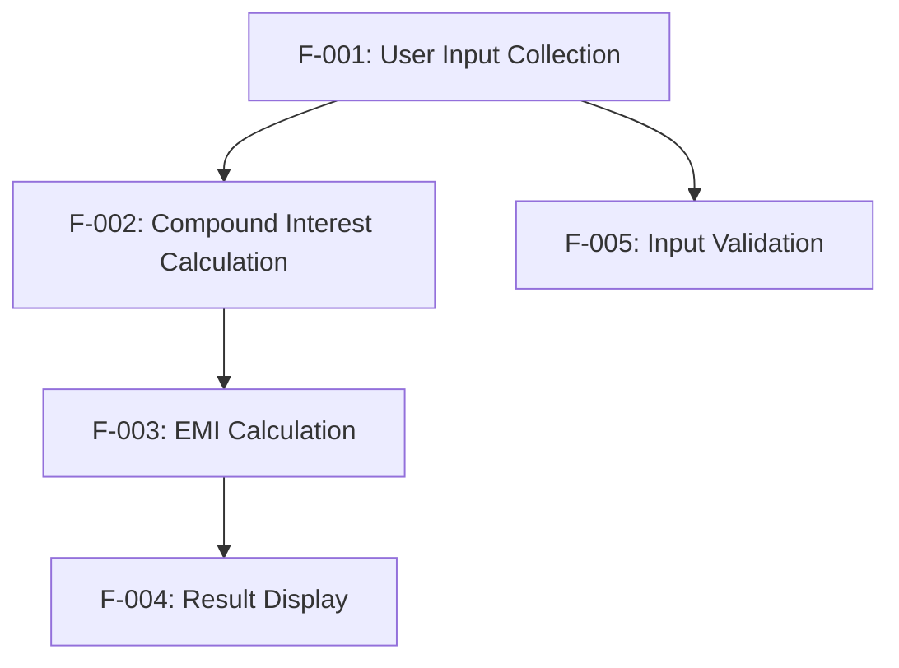
```mermaid
graph TD
    F001[F-001: User Input Collection] --> F002[F-002: Compound Interest Calculation]
    F001 --> F005[F-005: Input Validation]
    F002 --> F003[F-003: EMI Calculation]
    F003 --> F004[F-004: Result Display]
```

#### 2.3.2 Integration Points

| Feature | Integration Points |
| ------- | ------------------ |
| F-001: User Input Collection | Provides validated input to F-002 |
| F-002: Compound Interest Calculation | Receives input from F-001, provides calculation results to F-003 |
| F-003: EMI Calculation | Receives compound interest calculation from F-002, provides EMI to F-004 |
| F-004: Result Display | Receives EMI calculation from F-003 |
| F-005: Input Validation | Validates inputs from F-001 |

#### 2.3.3 Shared Components

| Component | Used By Features |
| --------- | ---------------- |
| User Interface Framework | F-001, F-004 |
| Calculation Engine | F-002, F-003 |
| Validation Library | F-005 |

### 2.4 IMPLEMENTATION CONSIDERATIONS

#### 2.4.1 Technical Constraints

| Feature | Technical Constraints |
| ------- | --------------------- |
| F-001: User Input Collection | Must use Java Swing or JavaFX for UI components |
| F-002: Compound Interest Calculation | Must handle large principal amounts without precision loss |
| F-003: EMI Calculation | Must handle rounding appropriately for currency values |
| F-004: Result Display | Must format currency according to USD standards |
| F-005: Input Validation | Must provide clear error messages for invalid inputs |

#### 2.4.2 Performance Requirements

| Feature | Performance Requirements |
| ------- | ------------------------ |
| F-001: User Input Collection | UI responsiveness within 100ms |
| F-002: Compound Interest Calculation | Calculation completion within 500ms |
| F-003: EMI Calculation | Calculation completion within 500ms |
| F-004: Result Display | Display update within 100ms of calculation |
| F-005: Input Validation | Validation completion within 100ms |

#### 2.4.3 Maintenance Requirements

| Feature | Maintenance Requirements |
| ------- | ------------------------ |
| F-001: User Input Collection | UI components should be modular for easy updates |
| F-002: Compound Interest Calculation | Formula parameters should be configurable for future adjustments |
| F-003: EMI Calculation | Formula parameters should be configurable for future adjustments |
| F-004: Result Display | Currency formatting should be configurable |
| F-005: Input Validation | Validation rules should be centralized for easy updates |

## 3. TECHNOLOGY STACK

### 3.1 PROGRAMMING LANGUAGES

| Language | Component | Version | Justification |
| -------- | --------- | ------- | ------------- |
| Java | Core Application | 11 LTS | Selected for desktop application development as specified in requirements. Java 11 LTS provides long-term support, stability, and cross-platform compatibility. Java's robust standard libraries support the mathematical operations needed for compound interest and EMI calculations. |

### 3.2 FRAMEWORKS & LIBRARIES

| Framework/Library | Purpose | Version | Justification |
| ----------------- | ------- | ------- | ------------- |
| JavaFX | UI Framework | 11 | Provides modern, responsive UI components for desktop applications with better styling capabilities than Swing. Supports MVC architecture for clean separation of concerns. |
| Java BigDecimal | Precision Calculations | Built-in | Required for financial calculations to avoid floating-point precision errors when handling currency values. |
| JUnit | Unit Testing | 5.8.2 | Industry standard for Java unit testing, allowing comprehensive test coverage for calculation logic and input validation. |

### 3.3 DEVELOPMENT & DEPLOYMENT

| Tool/Technology | Purpose | Version | Justification |
| --------------- | ------- | ------- | ------------- |
| Maven | Build System | 3.8.6 | Provides dependency management, build automation, and packaging for Java applications. Simplifies the build process and dependency management. |
| Git | Version Control | Latest | Industry standard for source code management, enabling collaborative development and version tracking. |
| JPackage | Application Packaging | JDK 14+ | Enables packaging the Java application as a native installer for Windows, macOS, and Linux, providing a seamless installation experience. |
| Eclipse/IntelliJ IDEA | IDE | Latest | Professional Java development environments with robust debugging, refactoring, and code analysis tools. |

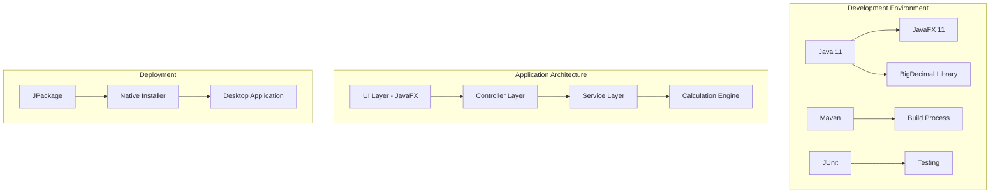
```mermaid
graph TD
    subgraph "Development Environment"
        A[Java 11] --> B[JavaFX 11]
        A --> C[BigDecimal Library]
        D[Maven] --> E[Build Process]
        F[JUnit] --> G[Testing]
    end
    
    subgraph "Application Architecture"
        H[UI Layer - JavaFX] --> I[Controller Layer]
        I --> J[Service Layer]
        J --> K[Calculation Engine]
    end
    
    subgraph "Deployment"
        L[JPackage] --> M[Native Installer]
        M --> N[Desktop Application]
    end
```

### 3.4 TECHNOLOGY CONSTRAINTS & CONSIDERATIONS

| Constraint | Impact | Mitigation |
| ---------- | ------ | ---------- |
| Cross-platform compatibility | Must run on different operating systems used by bank branches | Java's "write once, run anywhere" capability addresses this with proper JRE installation |
| Financial calculation precision | Currency calculations require exact precision | Use of BigDecimal instead of floating-point types for all financial calculations |
| Offline operation | Application must function without internet connectivity | Standalone desktop application with no external dependencies |
| Performance on older hardware | Bank branches may have varying hardware capabilities | Lightweight application design with minimal resource requirements |

## 4. PROCESS FLOWCHART

### 4.1 SYSTEM WORKFLOWS

#### 4.1.1 Core Business Processes

##### Main Application Workflow

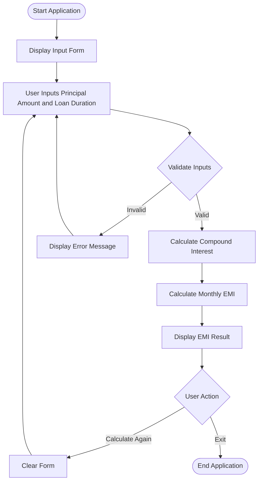
```mermaid
flowchart TD
    Start([Start Application]) --> DisplayUI[Display Input Form]
    DisplayUI --> InputData[User Inputs Principal Amount and Loan Duration]
    InputData --> ValidateInput{Validate Inputs}
    ValidateInput -->|Valid| CalculateCompoundInterest[Calculate Compound Interest]
    ValidateInput -->|Invalid| DisplayError[Display Error Message]
    DisplayError --> InputData
    CalculateCompoundInterest --> CalculateEMI[Calculate Monthly EMI]
    CalculateEMI --> DisplayResult[Display EMI Result]
    DisplayResult --> UserAction{User Action}
    UserAction -->|Calculate Again| ClearForm[Clear Form]
    ClearForm --> InputData
    UserAction -->|Exit| End([End Application])
```

##### User Input Journey

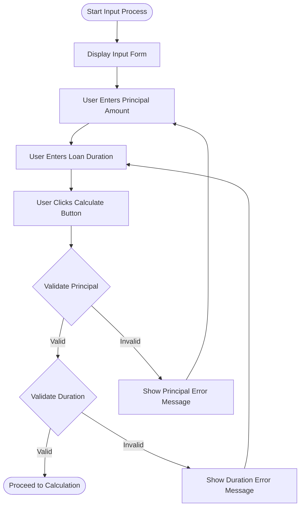
```mermaid
flowchart TD
    Start([Start Input Process]) --> DisplayForm[Display Input Form]
    DisplayForm --> EnterPrincipal[User Enters Principal Amount]
    EnterPrincipal --> EnterDuration[User Enters Loan Duration]
    EnterDuration --> ClickCalculate[User Clicks Calculate Button]
    ClickCalculate --> ValidatePrincipal{Validate Principal}
    ValidatePrincipal -->|Valid| ValidateDuration{Validate Duration}
    ValidatePrincipal -->|Invalid| ShowPrincipalError[Show Principal Error Message]
    ShowPrincipalError --> EnterPrincipal
    ValidateDuration -->|Valid| ProceedCalculation([Proceed to Calculation])
    ValidateDuration -->|Invalid| ShowDurationError[Show Duration Error Message]
    ShowDurationError --> EnterDuration
```

##### Error Handling Path

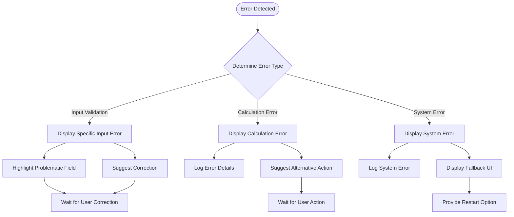
```mermaid
flowchart TD
    Start([Error Detected]) --> DetermineErrorType{Determine Error Type}
    DetermineErrorType -->|Input Validation| HandleInputError[Display Specific Input Error]
    DetermineErrorType -->|Calculation Error| HandleCalcError[Display Calculation Error]
    DetermineErrorType -->|System Error| HandleSysError[Display System Error]
    HandleInputError --> HighlightField[Highlight Problematic Field]
    HandleInputError --> SuggestCorrection[Suggest Correction]
    HandleCalcError --> LogError[Log Error Details]
    HandleCalcError --> SuggestAlternative[Suggest Alternative Action]
    HandleSysError --> LogSystemError[Log System Error]
    HandleSysError --> DisplayFallbackUI[Display Fallback UI]
    HighlightField --> WaitForCorrection[Wait for User Correction]
    SuggestCorrection --> WaitForCorrection
    SuggestAlternative --> WaitForUserAction[Wait for User Action]
    DisplayFallbackUI --> RestartOption[Provide Restart Option]
```

#### 4.1.2 Integration Workflows

##### Data Flow Diagram

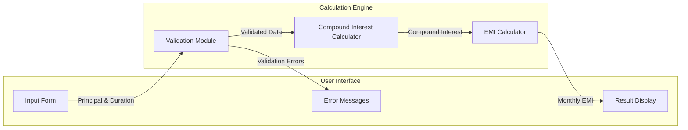
```mermaid
flowchart LR
    subgraph User Interface
        InputForm[Input Form]
        ResultDisplay[Result Display]
        ErrorMessages[Error Messages]
    end
    
    subgraph Calculation Engine
        ValidationModule[Validation Module]
        CompoundInterestCalculator[Compound Interest Calculator]
        EMICalculator[EMI Calculator]
    end
    
    InputForm -->|Principal & Duration| ValidationModule
    ValidationModule -->|Validated Data| CompoundInterestCalculator
    ValidationModule -->|Validation Errors| ErrorMessages
    CompoundInterestCalculator -->|Compound Interest| EMICalculator
    EMICalculator -->|Monthly EMI| ResultDisplay
```

### 4.2 FLOWCHART REQUIREMENTS

#### 4.2.1 Detailed Feature Workflows

##### F-001: User Input Collection

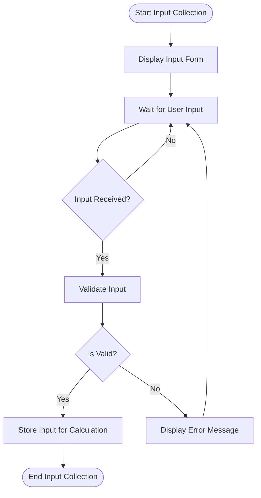
```mermaid
flowchart TD
    Start([Start Input Collection]) --> DisplayForm[Display Input Form]
    DisplayForm --> WaitForInput[Wait for User Input]
    WaitForInput --> InputReceived{Input Received?}
    InputReceived -->|No| WaitForInput
    InputReceived -->|Yes| ValidateInput[Validate Input]
    ValidateInput --> IsValid{Is Valid?}
    IsValid -->|Yes| StoreInput[Store Input for Calculation]
    IsValid -->|No| DisplayError[Display Error Message]
    DisplayError --> WaitForInput
    StoreInput --> End([End Input Collection])
```

##### F-002: Compound Interest Calculation

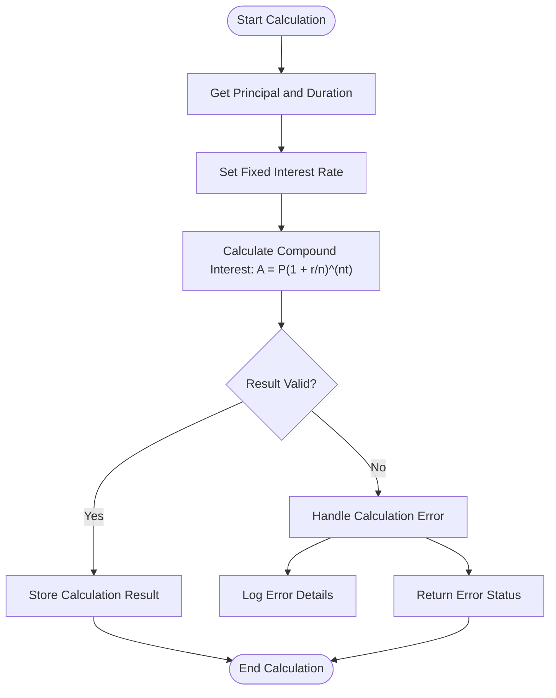
```mermaid
flowchart TD
    Start([Start Calculation]) --> GetInputs[Get Principal and Duration]
    GetInputs --> SetInterestRate[Set Fixed Interest Rate]
    SetInterestRate --> CalculateCompoundInterest["Calculate Compound Interest: A = P(1 + r/n)^(nt)"]
    CalculateCompoundInterest --> ValidateResult{Result Valid?}
    ValidateResult -->|Yes| StoreResult[Store Calculation Result]
    ValidateResult -->|No| HandleError[Handle Calculation Error]
    HandleError --> LogError[Log Error Details]
    HandleError --> ReturnError[Return Error Status]
    StoreResult --> End([End Calculation])
    ReturnError --> End
```

##### F-003: EMI Calculation

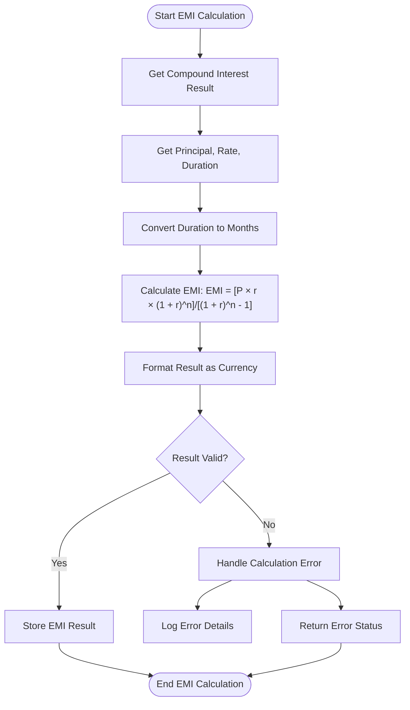
```mermaid
flowchart TD
    Start([Start EMI Calculation]) --> GetCompoundInterest[Get Compound Interest Result]
    GetCompoundInterest --> GetInputs[Get Principal, Rate, Duration]
    GetInputs --> ConvertToMonths[Convert Duration to Months]
    ConvertToMonths --> CalculateEMI["Calculate EMI: EMI = [P × r × (1 + r)^n]/[(1 + r)^n - 1]"]
    CalculateEMI --> FormatResult[Format Result as Currency]
    FormatResult --> ValidateResult{Result Valid?}
    ValidateResult -->|Yes| StoreResult[Store EMI Result]
    ValidateResult -->|No| HandleError[Handle Calculation Error]
    HandleError --> LogError[Log Error Details]
    HandleError --> ReturnError[Return Error Status]
    StoreResult --> End([End EMI Calculation])
    ReturnError --> End
```

##### F-004: Result Display

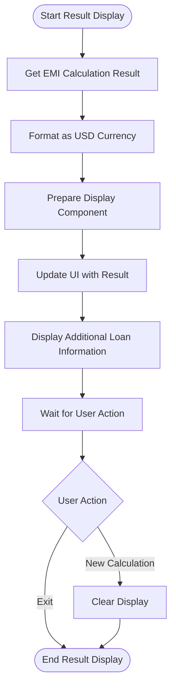
```mermaid
flowchart TD
    Start([Start Result Display]) --> GetEMIResult[Get EMI Calculation Result]
    GetEMIResult --> FormatCurrency[Format as USD Currency]
    FormatCurrency --> PrepareDisplay[Prepare Display Component]
    PrepareDisplay --> UpdateUI[Update UI with Result]
    UpdateUI --> DisplayAdditionalInfo[Display Additional Loan Information]
    DisplayAdditionalInfo --> WaitForUserAction[Wait for User Action]
    WaitForUserAction --> UserAction{User Action}
    UserAction -->|New Calculation| ClearDisplay[Clear Display]
    UserAction -->|Exit| End([End Result Display])
    ClearDisplay --> End
```

##### F-005: Input Validation

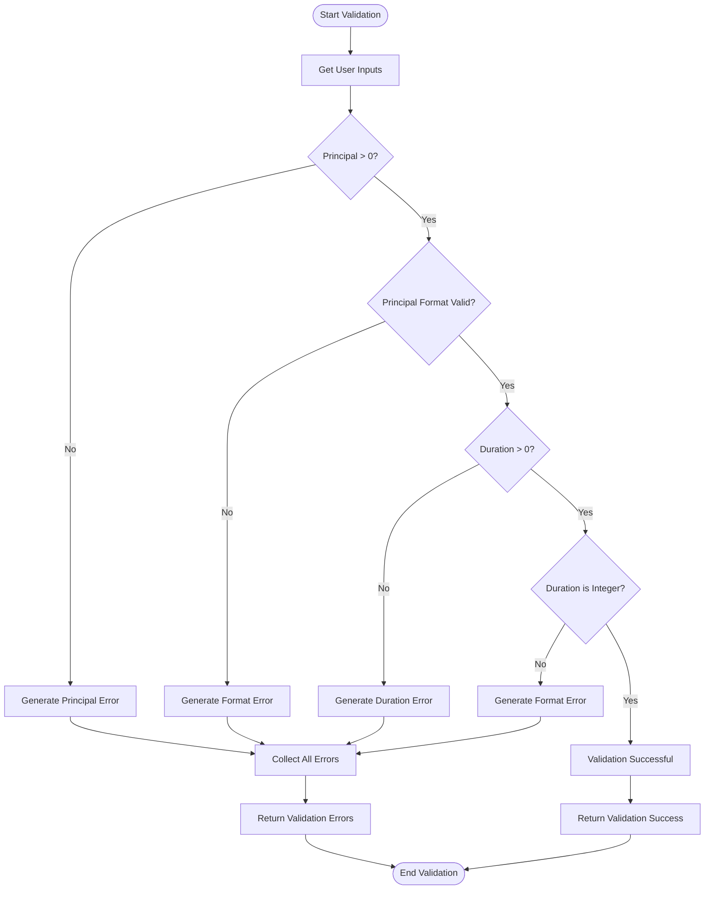
```mermaid
flowchart TD
    Start([Start Validation]) --> GetInputs[Get User Inputs]
    GetInputs --> ValidatePrincipal{Principal > 0?}
    ValidatePrincipal -->|Yes| ValidatePrincipalFormat{Principal Format Valid?}
    ValidatePrincipal -->|No| GeneratePrincipalError[Generate Principal Error]
    ValidatePrincipalFormat -->|Yes| ValidateDuration{Duration > 0?}
    ValidatePrincipalFormat -->|No| GeneratePrincipalFormatError[Generate Format Error]
    ValidateDuration -->|Yes| ValidateDurationFormat{Duration is Integer?}
    ValidateDuration -->|No| GenerateDurationError[Generate Duration Error]
    ValidateDurationFormat -->|Yes| ValidationSuccess[Validation Successful]
    ValidateDurationFormat -->|No| GenerateDurationFormatError[Generate Format Error]
    GeneratePrincipalError --> CollectErrors[Collect All Errors]
    GeneratePrincipalFormatError --> CollectErrors
    GenerateDurationError --> CollectErrors
    GenerateDurationFormatError --> CollectErrors
    CollectErrors --> ReturnErrors[Return Validation Errors]
    ValidationSuccess --> ReturnSuccess[Return Validation Success]
    ReturnErrors --> End([End Validation])
    ReturnSuccess --> End
```

#### 4.2.2 Error Handling Flowchart

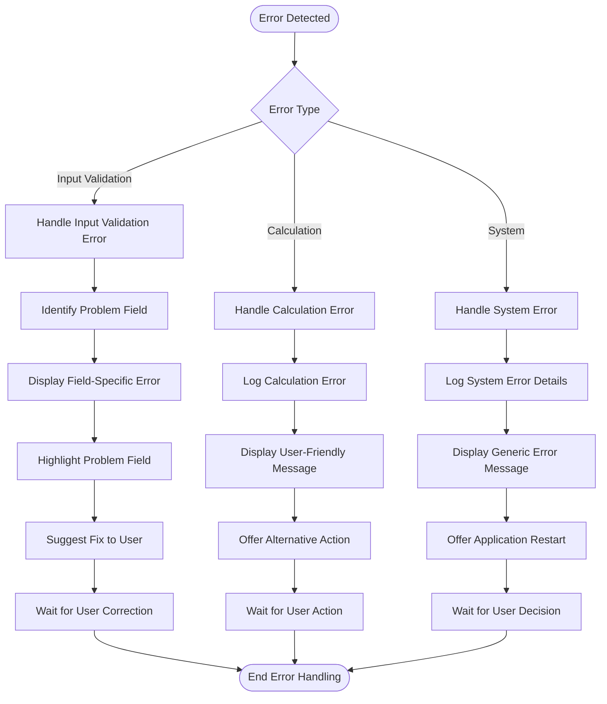
```mermaid
flowchart TD
    Start([Error Detected]) --> CategorizeError{Error Type}
    CategorizeError -->|Input Validation| HandleInputError[Handle Input Validation Error]
    CategorizeError -->|Calculation| HandleCalcError[Handle Calculation Error]
    CategorizeError -->|System| HandleSystemError[Handle System Error]
    
    HandleInputError --> IdentifyField[Identify Problem Field]
    IdentifyField --> DisplayFieldError[Display Field-Specific Error]
    DisplayFieldError --> HighlightField[Highlight Problem Field]
    HighlightField --> SuggestFix[Suggest Fix to User]
    
    HandleCalcError --> LogCalcError[Log Calculation Error]
    LogCalcError --> DisplayCalcError[Display User-Friendly Message]
    DisplayCalcError --> OfferAlternative[Offer Alternative Action]
    
    HandleSystemError --> LogSystemError[Log System Error Details]
    LogSystemError --> DisplayGenericError[Display Generic Error Message]
    DisplayGenericError --> OfferRestart[Offer Application Restart]
    
    SuggestFix --> WaitForCorrection[Wait for User Correction]
    OfferAlternative --> WaitForUserAction[Wait for User Action]
    OfferRestart --> WaitForUserDecision[Wait for User Decision]
    
    WaitForCorrection --> End([End Error Handling])
    WaitForUserAction --> End
    WaitForUserDecision --> End
```

### 4.3 TECHNICAL IMPLEMENTATION

#### 4.3.1 State Management

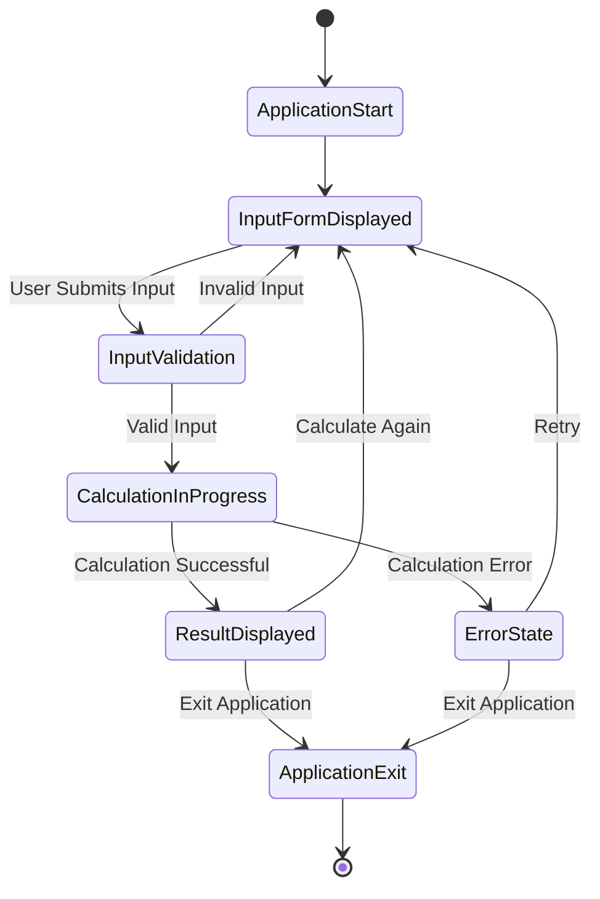
```mermaid
stateDiagram-v2
    [*] --> ApplicationStart
    ApplicationStart --> InputFormDisplayed
    
    InputFormDisplayed --> InputValidation: User Submits Input
    InputValidation --> InputFormDisplayed: Invalid Input
    InputValidation --> CalculationInProgress: Valid Input
    
    CalculationInProgress --> ResultDisplayed: Calculation Successful
    CalculationInProgress --> ErrorState: Calculation Error
    
    ResultDisplayed --> InputFormDisplayed: Calculate Again
    ResultDisplayed --> ApplicationExit: Exit Application
    
    ErrorState --> InputFormDisplayed: Retry
    ErrorState --> ApplicationExit: Exit Application
    
    ApplicationExit --> [*]
```

#### 4.3.2 Error Handling Implementation

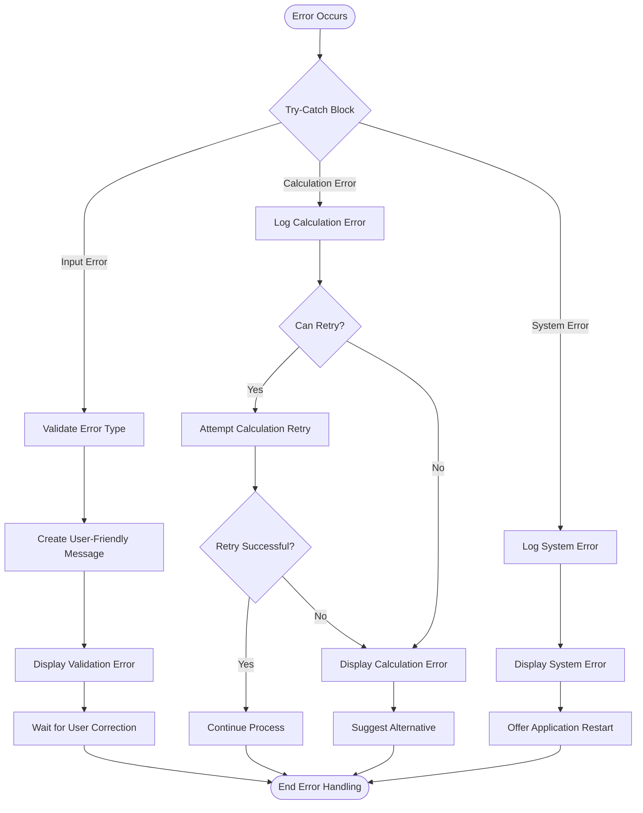
```mermaid
flowchart TD
    Start([Error Occurs]) --> TryCatch{Try-Catch Block}
    TryCatch -->|Input Error| ValidateErrorType[Validate Error Type]
    TryCatch -->|Calculation Error| LogCalculationError[Log Calculation Error]
    TryCatch -->|System Error| LogSystemError[Log System Error]
    
    ValidateErrorType --> CreateErrorMessage[Create User-Friendly Message]
    LogCalculationError --> CheckRetry{Can Retry?}
    LogSystemError --> DisplaySystemError[Display System Error]
    
    CreateErrorMessage --> DisplayValidationError[Display Validation Error]
    CheckRetry -->|Yes| AttemptRetry[Attempt Calculation Retry]
    CheckRetry -->|No| DisplayCalculationError[Display Calculation Error]
    
    DisplayValidationError --> WaitForCorrection[Wait for User Correction]
    AttemptRetry --> RetrySuccessful{Retry Successful?}
    DisplayCalculationError --> SuggestAlternative[Suggest Alternative]
    DisplaySystemError --> OfferRestart[Offer Application Restart]
    
    RetrySuccessful -->|Yes| ContinueProcess[Continue Process]
    RetrySuccessful -->|No| DisplayCalculationError
    
    WaitForCorrection --> End([End Error Handling])
    ContinueProcess --> End
    SuggestAlternative --> End
    OfferRestart --> End
```

### 4.4 HIGH-LEVEL SYSTEM WORKFLOW

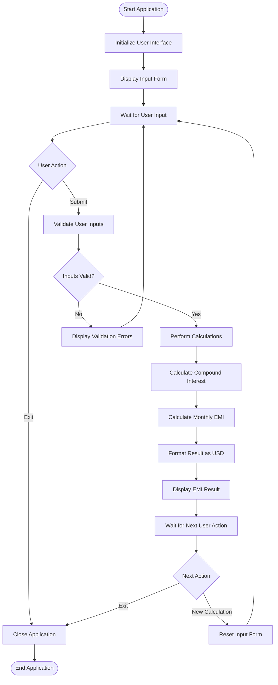
```mermaid
flowchart TD
    Start([Start Application]) --> InitializeUI[Initialize User Interface]
    InitializeUI --> DisplayInputForm[Display Input Form]
    DisplayInputForm --> WaitForUserInput[Wait for User Input]
    
    WaitForUserInput --> UserAction{User Action}
    UserAction -->|Submit| ValidateInputs[Validate User Inputs]
    UserAction -->|Exit| CloseApplication[Close Application]
    
    ValidateInputs --> InputValid{Inputs Valid?}
    InputValid -->|Yes| PerformCalculation[Perform Calculations]
    InputValid -->|No| DisplayValidationErrors[Display Validation Errors]
    DisplayValidationErrors --> WaitForUserInput
    
    PerformCalculation --> CalculateCompoundInterest[Calculate Compound Interest]
    CalculateCompoundInterest --> CalculateEMI[Calculate Monthly EMI]
    CalculateEMI --> FormatResult[Format Result as USD]
    FormatResult --> DisplayResult[Display EMI Result]
    
    DisplayResult --> WaitForNextAction[Wait for Next User Action]
    WaitForNextAction --> NextAction{Next Action}
    NextAction -->|New Calculation| ResetForm[Reset Input Form]
    NextAction -->|Exit| CloseApplication
    
    ResetForm --> WaitForUserInput
    CloseApplication --> End([End Application])
```

### 4.5 SWIM LANE DIAGRAM FOR SYSTEM INTERACTIONS

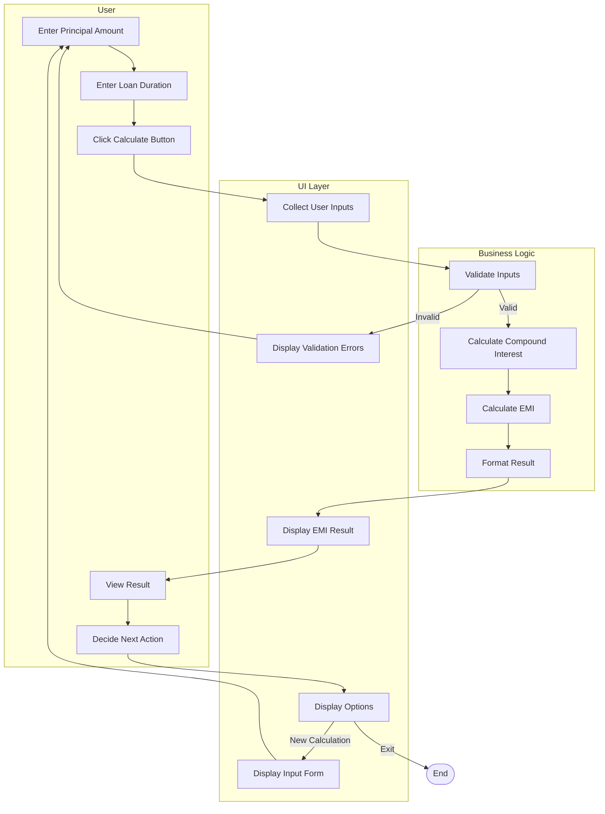
```mermaid
flowchart TD
    %% Swim lanes
    subgraph User
        U1[Enter Principal Amount]
        U2[Enter Loan Duration]
        U3[Click Calculate Button]
        U4[View Result]
        U5[Decide Next Action]
    end
    
    subgraph UI Layer
        UI1[Display Input Form]
        UI2[Collect User Inputs]
        UI3[Display Validation Errors]
        UI4[Display EMI Result]
        UI5[Display Options]
    end
    
    subgraph Business Logic
        BL1[Validate Inputs]
        BL2[Calculate Compound Interest]
        BL3[Calculate EMI]
        BL4[Format Result]
    end
    
    %% Connections
    UI1 --> U1
    U1 --> U2
    U2 --> U3
    U3 --> UI2
    UI2 --> BL1
    BL1 -->|Invalid| UI3
    UI3 --> U1
    BL1 -->|Valid| BL2
    BL2 --> BL3
    BL3 --> BL4
    BL4 --> UI4
    UI4 --> U4
    U4 --> U5
    U5 --> UI5
    UI5 -->|New Calculation| UI1
    UI5 -->|Exit| End([End])
```

## 5. SYSTEM ARCHITECTURE

### 5.1 HIGH-LEVEL ARCHITECTURE

#### 5.1.1 System Overview

The Compound Interest Calculator application follows a layered architecture pattern with Model-View-Controller (MVC) design principles. This architectural approach was selected for its simplicity, maintainability, and appropriateness for desktop applications with straightforward user interactions.

- **Architectural Style**: Three-tier layered architecture with MVC pattern implementation
- **Key Principles**: Separation of concerns, single responsibility, loose coupling between layers
- **System Boundaries**: Self-contained desktop application with no external system dependencies
- **Major Interfaces**: User interface for input collection and result display

The application architecture emphasizes simplicity and reliability, focusing on accurate financial calculations while maintaining a clean separation between the presentation layer, business logic, and data handling components.

#### 5.1.2 Core Components Table

| Component Name | Primary Responsibility | Key Dependencies | Critical Considerations |
| -------------- | ---------------------- | ---------------- | ----------------------- |
| User Interface | Collect user inputs and display calculation results | JavaFX/Swing, Controller | Must provide clear input validation feedback and properly formatted currency output |
| Controller | Coordinate interactions between UI and calculation service | UI Layer, Calculation Service | Must handle all user events and orchestrate the application workflow |
| Calculation Service | Implement compound interest and EMI calculation logic | BigDecimal library | Must ensure precision in financial calculations and handle edge cases |
| Validation Service | Validate user inputs before processing | None | Must provide comprehensive validation for all input fields |

#### 5.1.3 Data Flow Description

The data flow in the Compound Interest Calculator follows a simple, linear pattern:

1. User inputs (principal amount and loan duration) are collected through the UI layer
2. Input data is passed to the validation service for verification
3. Validated data flows to the calculation service where compound interest is calculated
4. The calculation service computes the EMI based on the compound interest result
5. Formatted results flow back to the UI layer for display to the user

The application does not require persistent data storage as it performs calculations on-demand without saving historical data. All data transformations occur in-memory during the calculation process, with special attention to numerical precision for financial calculations.

#### 5.1.4 External Integration Points

As a standalone desktop application with no external system dependencies, the Compound Interest Calculator does not have external integration points. All functionality is self-contained within the application.

### 5.2 COMPONENT DETAILS

#### 5.2.1 User Interface Component

- **Purpose**: Provide an intuitive interface for users to input loan parameters and view calculation results
- **Technologies**: JavaFX for modern UI components with CSS styling
- **Key Interfaces**: Input forms for principal amount and loan duration, result display area
- **Data Persistence**: No persistence requirements (stateless UI)
- **Scaling Considerations**: Must support various screen resolutions and accessibility requirements

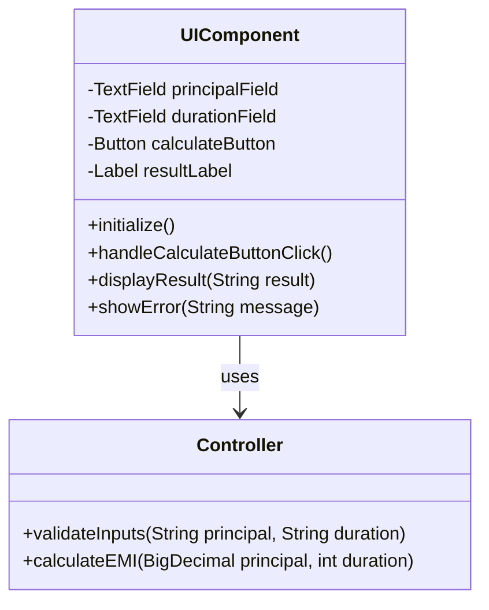
```mermaid
classDiagram
    class UIComponent {
        -TextField principalField
        -TextField durationField
        -Button calculateButton
        -Label resultLabel
        +initialize()
        +handleCalculateButtonClick()
        +displayResult(String result)
        +showError(String message)
    }
    
    class Controller {
        +validateInputs(String principal, String duration)
        +calculateEMI(BigDecimal principal, int duration)
    }
    
    UIComponent --> Controller: uses
```

#### 5.2.2 Controller Component

- **Purpose**: Coordinate application flow and mediate between UI and services
- **Technologies**: Java core libraries
- **Key Interfaces**: Methods for handling UI events and delegating to appropriate services
- **Data Persistence**: No persistence requirements
- **Scaling Considerations**: Must maintain responsiveness under all conditions

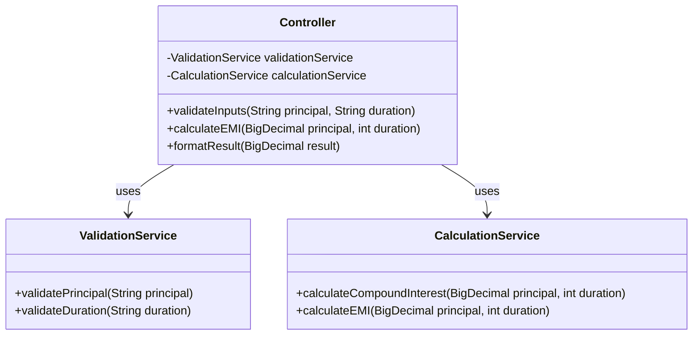
```mermaid
classDiagram
    class Controller {
        -ValidationService validationService
        -CalculationService calculationService
        +validateInputs(String principal, String duration)
        +calculateEMI(BigDecimal principal, int duration)
        +formatResult(BigDecimal result)
    }
    
    class ValidationService {
        +validatePrincipal(String principal)
        +validateDuration(String duration)
    }
    
    class CalculationService {
        +calculateCompoundInterest(BigDecimal principal, int duration)
        +calculateEMI(BigDecimal principal, int duration)
    }
    
    Controller --> ValidationService: uses
    Controller --> CalculationService: uses
```

#### 5.2.3 Calculation Service Component

- **Purpose**: Implement financial calculation logic for compound interest and EMI
- **Technologies**: Java BigDecimal for precise financial calculations
- **Key Interfaces**: Methods for compound interest and EMI calculation
- **Data Persistence**: No persistence requirements
- **Scaling Considerations**: Must handle large principal amounts without precision loss

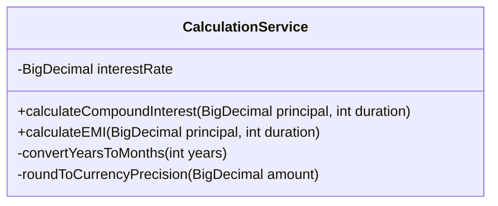
```mermaid
classDiagram
    class CalculationService {
        -BigDecimal interestRate
        +calculateCompoundInterest(BigDecimal principal, int duration)
        +calculateEMI(BigDecimal principal, int duration)
        -convertYearsToMonths(int years)
        -roundToCurrencyPrecision(BigDecimal amount)
    }
```

#### 5.2.4 Validation Service Component

- **Purpose**: Validate user inputs before processing
- **Technologies**: Java core libraries
- **Key Interfaces**: Methods for validating principal amount and loan duration
- **Data Persistence**: No persistence requirements
- **Scaling Considerations**: Must provide fast validation response for optimal user experience

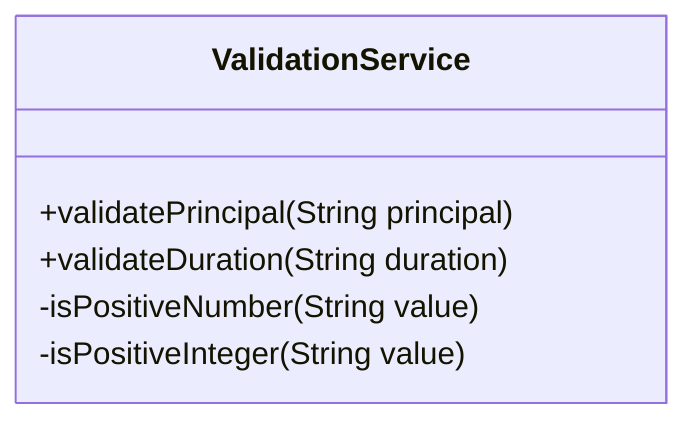
```mermaid
classDiagram
    class ValidationService {
        +validatePrincipal(String principal)
        +validateDuration(String duration)
        -isPositiveNumber(String value)
        -isPositiveInteger(String value)
    }
```

#### 5.2.5 Key Sequence Diagram

```mermaid
sequenceDiagram
    actor User
    participant UI as User Interface
    participant C as Controller
    participant VS as Validation Service
    participant CS as Calculation Service
    
    User->>UI: Enter principal amount
    User->>UI: Enter loan duration
    User->>UI: Click Calculate button
    UI->>C: handleCalculateButtonClick()
    C->>VS: validatePrincipal(principal)
    C->>VS: validateDuration(duration)
    alt Invalid Input
        C->>UI: showError(message)
    else Valid Input
        C->>CS: calculateCompoundInterest(principal, duration)
        CS->>CS: Perform compound interest calculation
        CS-->>C: Return compound interest result
        C->>CS: calculateEMI(principal, duration)
        CS->>CS: Perform EMI calculation
        CS-->>C: Return EMI result
        C->>C: formatResult(result)
        C->>UI: displayResult(formattedResult)
        UI->>User: Show EMI result
    end
```

### 5.3 TECHNICAL DECISIONS

#### 5.3.1 Architecture Style Decisions

| Decision | Rationale | Alternatives Considered | Tradeoffs |
| -------- | --------- | ----------------------- | --------- |
| Layered Architecture with MVC | Provides clear separation of concerns and is well-suited for desktop applications with simple workflows | Hexagonal Architecture, Clean Architecture | Sacrifices some flexibility for simplicity and development speed |
| Standalone Desktop Application | Meets requirement for a desktop app with no external dependencies | Web Application, Client-Server | Limits accessibility but simplifies deployment and eliminates network dependencies |
| In-Memory Processing | Application performs calculations on-demand without need for persistence | Database-backed solution | Simplifies architecture but doesn't support historical data or multi-user scenarios |

#### 5.3.2 Technology Selection Decisions

| Technology | Rationale | Alternatives Considered | Tradeoffs |
| ---------- | --------- | ----------------------- | --------- |
| Java 11 | Meets requirement for Java development with LTS support | Java 8, Java 17 | Balances modern language features with stability and compatibility |
| JavaFX | Provides modern UI capabilities with better styling than Swing | Swing, SWT | More modern but may require additional runtime components |
| BigDecimal | Essential for precise financial calculations | Double, Float | Higher precision at cost of performance, justified for financial calculations |
| Maven | Industry standard build tool with excellent dependency management | Gradle, Ant | More verbose configuration but widely understood and supported |

```mermaid
graph TD
    A[Architecture Decision] --> B{Application Type}
    B -->|Desktop Application| C[Layered Architecture with MVC]
    B -->|Web Application| D[Not Selected]
    B -->|Mobile Application| E[Not Selected]
    
    C --> F{UI Framework}
    F -->|Modern UI with Styling| G[JavaFX]
    F -->|Simpler UI| H[Swing - Not Selected]
    
    C --> I{Calculation Precision}
    I -->|Financial Precision Required| J[BigDecimal]
    I -->|Performance Priority| K[Primitive Types - Not Selected]
```

### 5.4 CROSS-CUTTING CONCERNS

#### 5.4.1 Error Handling Approach

The application implements a comprehensive error handling strategy focused on user input validation and calculation error management:

- **Input Validation**: All user inputs are validated before processing with clear error messages
- **Calculation Errors**: Edge cases in financial calculations are handled with appropriate fallbacks
- **Exception Handling**: Structured exception handling with specific exception types for different error categories
- **User Feedback**: Clear, actionable error messages displayed in the UI

```mermaid
flowchart TD
    A[Error Occurs] --> B{Error Type}
    B -->|Input Validation| C[Display Field-Specific Error]
    B -->|Calculation Error| D[Log Error Details]
    B -->|System Error| E[Log Error and Show Generic Message]
    
    C --> F[Highlight Problem Field]
    C --> G[Provide Correction Guidance]
    
    D --> H[Display User-Friendly Message]
    D --> I[Suggest Alternative Input]
    
    E --> J[Offer Application Restart]
    
    F --> K[Wait for User Correction]
    G --> K
    H --> L[Wait for User Action]
    I --> L
    J --> M[Handle User Decision]
```

#### 5.4.2 Performance Requirements

| Requirement | Target | Approach |
| ----------- | ------ | -------- |
| UI Responsiveness | < 100ms for all UI interactions | Lightweight UI components, background processing for calculations |
| Calculation Time | < 500ms for all calculations | Efficient algorithm implementation, optimized BigDecimal usage |
| Memory Usage | < 100MB | Minimal object creation, no unnecessary caching |
| Startup Time | < 3 seconds | Lazy loading of non-essential components |

#### 5.4.3 Logging Strategy

For a desktop application of this scope, a simple logging approach is implemented:

- **Development Logging**: Comprehensive logging during development for debugging
- **Production Logging**: Minimal logging focused on critical errors and exceptions
- **Log Storage**: Local log file with rotation policy
- **Log Levels**: ERROR, WARN, INFO, DEBUG with appropriate filtering

#### 5.4.4 Testing Approach

| Testing Type | Focus Areas | Tools |
| ------------ | ----------- | ----- |
| Unit Testing | Calculation logic, validation rules | JUnit 5 |
| Integration Testing | Component interactions | JUnit 5 |
| UI Testing | User interface functionality | TestFX |
| Performance Testing | Calculation efficiency with large values | JMH |

## 6. SYSTEM COMPONENTS DESIGN

### 6.1 COMPONENT SPECIFICATIONS

#### 6.1.1 User Interface Component

| Aspect | Specification |
| ------ | ------------- |
| Component Name | UI Component |
| Component Type | Presentation Layer |
| Primary Responsibility | Collect user inputs and display calculation results |
| Key Dependencies | JavaFX, Controller Component |

**UI Elements**
| Element | Type | Purpose | Validation Rules |
| ------- | ---- | ------- | ---------------- |
| Principal Amount Field | TextField | Collect principal amount in USD | Must be positive number with up to 2 decimal places |
| Loan Duration Field | TextField | Collect loan duration in years | Must be positive integer |
| Calculate Button | Button | Trigger calculation process | Enabled only when fields have content |
| Result Display | Label | Show calculated EMI amount | Displays formatted currency value |
| Error Message Area | Label | Display validation errors | Shows specific error messages |

**Layout Design**
```mermaid
graph TD
    subgraph MainWindow["Main Window"]
        subgraph InputSection["Input Section"]
            PrincipalLabel["Principal Amount (USD):"]
            PrincipalField["TextField"]
            DurationLabel["Loan Duration (Years):"]
            DurationField["TextField"]
        end
        subgraph ActionSection["Action Section"]
            CalculateButton["Calculate EMI"]
        end
        subgraph ResultSection["Result Section"]
            ResultLabel["Monthly EMI:"]
            ResultValue["$0.00"]
            ErrorMessage["Error messages appear here"]
        end
    end
```

#### 6.1.2 Controller Component

| Aspect | Specification |
| ------ | ------------- |
| Component Name | Controller Component |
| Component Type | Control Layer |
| Primary Responsibility | Coordinate application flow and mediate between UI and services |
| Key Dependencies | UI Component, Validation Service, Calculation Service |

**Public Methods**
| Method | Parameters | Return Type | Purpose |
| ------ | ---------- | ----------- | ------- |
| validateInputs | String principal, String duration | ValidationResult | Validate user inputs before calculation |
| calculateEMI | BigDecimal principal, int duration | BigDecimal | Orchestrate the calculation process |
| formatResult | BigDecimal result | String | Format calculation result as USD currency |
| handleCalculateAction | None | void | Handle calculate button click event |

**Internal Methods**
| Method | Parameters | Return Type | Purpose |
| ------ | ---------- | ----------- | ------- |
| displayError | String message | void | Display error message in UI |
| clearError | None | void | Clear error message from UI |
| updateResultDisplay | String formattedResult | void | Update result display with calculation result |

#### 6.1.3 Validation Service Component

| Aspect | Specification |
| ------ | ------------- |
| Component Name | Validation Service |
| Component Type | Service Layer |
| Primary Responsibility | Validate user inputs before processing |
| Key Dependencies | None |

**Public Methods**
| Method | Parameters | Return Type | Purpose |
| ------ | ---------- | ----------- | ------- |
| validatePrincipal | String principal | ValidationResult | Validate principal amount input |
| validateDuration | String duration | ValidationResult | Validate loan duration input |
| validateAllInputs | String principal, String duration | ValidationResult | Validate all inputs together |

**Validation Rules**
| Input Field | Validation Rules | Error Message |
| ----------- | ---------------- | ------------- |
| Principal Amount | Must be numeric, positive, with up to 2 decimal places | "Principal amount must be a positive number" |
| Loan Duration | Must be numeric, positive integer | "Loan duration must be a positive whole number of years" |

#### 6.1.4 Calculation Service Component

| Aspect | Specification |
| ------ | ------------- |
| Component Name | Calculation Service |
| Component Type | Service Layer |
| Primary Responsibility | Implement financial calculation logic |
| Key Dependencies | Java BigDecimal library |

**Public Methods**
| Method | Parameters | Return Type | Purpose |
| ------ | ---------- | ----------- | ------- |
| calculateCompoundInterest | BigDecimal principal, int durationYears | BigDecimal | Calculate compound interest amount |
| calculateEMI | BigDecimal principal, int durationYears | BigDecimal | Calculate monthly EMI amount |
| getInterestRate | None | BigDecimal | Get current interest rate used for calculations |
| setInterestRate | BigDecimal rate | void | Set interest rate for calculations |

**Calculation Formulas**
| Calculation | Formula | Description |
| ----------- | ------- | ----------- |
| Compound Interest | A = P(1 + r/n)^(nt) | A = final amount, P = principal, r = annual interest rate, n = compounding frequency, t = time in years |
| EMI | EMI = [P × r × (1 + r)^n]/[(1 + r)^n - 1] | P = principal, r = monthly interest rate, n = number of monthly installments |

### 6.2 COMPONENT INTERACTIONS

#### 6.2.1 Component Interaction Diagram

```mermaid
classDiagram
    class UIComponent {
        -TextField principalField
        -TextField durationField
        -Button calculateButton
        -Label resultLabel
        -Label errorLabel
        +initialize()
        +handleCalculateButtonClick()
        +displayResult(String result)
        +showError(String message)
        +clearError()
    }
    
    class Controller {
        -ValidationService validationService
        -CalculationService calculationService
        -UIComponent uiComponent
        +validateInputs(String principal, String duration)
        +calculateEMI(BigDecimal principal, int duration)
        +formatResult(BigDecimal result)
        +handleCalculateAction()
        -displayError(String message)
        -clearError()
        -updateResultDisplay(String formattedResult)
    }
    
    class ValidationService {
        +validatePrincipal(String principal)
        +validateDuration(String duration)
        +validateAllInputs(String principal, String duration)
        -isPositiveNumber(String value)
        -isPositiveInteger(String value)
    }
    
    class CalculationService {
        -BigDecimal interestRate
        +calculateCompoundInterest(BigDecimal principal, int duration)
        +calculateEMI(BigDecimal principal, int duration)
        +getInterestRate()
        +setInterestRate(BigDecimal rate)
        -convertYearsToMonths(int years)
        -roundToCurrencyPrecision(BigDecimal amount)
    }
    
    class ValidationResult {
        -boolean valid
        -String errorMessage
        +isValid()
        +getErrorMessage()
    }
    
    UIComponent --> Controller: uses
    Controller --> ValidationService: uses
    Controller --> CalculationService: uses
    ValidationService --> ValidationResult: creates
    Controller --> UIComponent: updates
```

#### 6.2.2 Sequence Diagram for EMI Calculation

```mermaid
sequenceDiagram
    actor User
    participant UI as UIComponent
    participant C as Controller
    participant VS as ValidationService
    participant CS as CalculationService
    
    User->>UI: Enter principal amount
    User->>UI: Enter loan duration
    User->>UI: Click Calculate button
    UI->>C: handleCalculateAction()
    C->>UI: Get input values
    UI-->>C: Return principal and duration
    C->>VS: validateAllInputs(principal, duration)
    VS->>VS: validatePrincipal(principal)
    VS->>VS: validateDuration(duration)
    VS-->>C: Return ValidationResult
    
    alt Invalid Input
        C->>UI: showError(errorMessage)
        UI->>User: Display error message
    else Valid Input
        C->>C: clearError()
        C->>UI: clearError()
        C->>CS: calculateEMI(principal, duration)
        CS->>CS: calculateCompoundInterest(principal, duration)
        CS->>CS: Convert years to months
        CS->>CS: Apply EMI formula
        CS->>CS: Round to currency precision
        CS-->>C: Return EMI amount
        C->>C: formatResult(emiAmount)
        C->>UI: displayResult(formattedResult)
        UI->>User: Display EMI result
    end
```

#### 6.2.3 Component Communication Patterns

| Communication Pattern | Description | Components Involved |
| --------------------- | ----------- | ------------------- |
| Event-Driven | UI events trigger controller actions | UI Component → Controller |
| Synchronous Request-Response | Service calls return immediate results | Controller → Validation Service, Controller → Calculation Service |
| Observer Pattern | UI updates based on state changes | Controller → UI Component |

### 6.3 DATA STRUCTURES

#### 6.3.1 Key Data Structures

| Data Structure | Purpose | Fields | Data Types |
| -------------- | ------- | ------ | ---------- |
| ValidationResult | Encapsulate validation results | valid, errorMessage | boolean, String |
| CalculationInput | Encapsulate calculation inputs | principal, duration | BigDecimal, int |
| CalculationResult | Encapsulate calculation results | emiAmount, totalAmount, interestAmount | BigDecimal, BigDecimal, BigDecimal |

#### 6.3.2 Class Definitions

**ValidationResult Class**
```
Class ValidationResult {
    private boolean valid;
    private String errorMessage;
    
    // Constructor, getters and setters
    public ValidationResult(boolean valid, String errorMessage) {
        this.valid = valid;
        this.errorMessage = errorMessage;
    }
    
    public boolean isValid() {
        return valid;
    }
    
    public String getErrorMessage() {
        return errorMessage;
    }
}
```

**CalculationInput Class**
```
Class CalculationInput {
    private BigDecimal principal;
    private int durationYears;
    
    // Constructor, getters and setters
    public CalculationInput(BigDecimal principal, int durationYears) {
        this.principal = principal;
        this.durationYears = durationYears;
    }
    
    public BigDecimal getPrincipal() {
        return principal;
    }
    
    public int getDurationYears() {
        return durationYears;
    }
}
```

**CalculationResult Class**
```
Class CalculationResult {
    private BigDecimal emiAmount;
    private BigDecimal totalAmount;
    private BigDecimal interestAmount;
    
    // Constructor, getters and setters
    public CalculationResult(BigDecimal emiAmount, BigDecimal totalAmount, BigDecimal interestAmount) {
        this.emiAmount = emiAmount;
        this.totalAmount = totalAmount;
        this.interestAmount = interestAmount;
    }
    
    public BigDecimal getEmiAmount() {
        return emiAmount;
    }
    
    public BigDecimal getTotalAmount() {
        return totalAmount;
    }
    
    public BigDecimal getInterestAmount() {
        return interestAmount;
    }
}
```

### 6.4 ALGORITHMS AND BUSINESS LOGIC

#### 6.4.1 Compound Interest Calculation Algorithm

| Algorithm Name | Compound Interest Calculation |
| -------------- | ----------------------------- |
| Purpose | Calculate the final amount after applying compound interest |
| Input Parameters | Principal amount (P), Duration in years (t), Annual interest rate (r), Compounding frequency (n) |
| Output | Final amount after compound interest (A) |
| Time Complexity | O(1) - Constant time |
| Space Complexity | O(1) - Constant space |

**Algorithm Steps:**
1. Convert annual interest rate to decimal form (r = r/100)
2. Calculate the compound interest formula: A = P(1 + r/n)^(nt)
3. Return the final amount A

**Pseudocode:**
```
function calculateCompoundInterest(principal, durationYears, annualRate, compoundingFrequency):
    // Convert annual rate to decimal
    decimalRate = annualRate / 100
    
    // Calculate compound interest
    ratePerPeriod = decimalRate / compoundingFrequency
    totalPeriods = compoundingFrequency * durationYears
    compoundFactor = (1 + ratePerPeriod)^totalPeriods
    finalAmount = principal * compoundFactor
    
    return finalAmount
```

#### 6.4.2 EMI Calculation Algorithm

| Algorithm Name | EMI Calculation |
| -------------- | --------------- |
| Purpose | Calculate the Equated Monthly Installment for a loan |
| Input Parameters | Principal amount (P), Duration in years (t), Annual interest rate (r) |
| Output | Monthly EMI amount |
| Time Complexity | O(1) - Constant time |
| Space Complexity | O(1) - Constant space |

**Algorithm Steps:**
1. Convert annual interest rate to monthly rate (r = r/12/100)
2. Convert loan duration from years to months (n = t*12)
3. Calculate EMI using formula: EMI = [P × r × (1 + r)^n]/[(1 + r)^n - 1]
4. Round the result to 2 decimal places
5. Return the EMI amount

**Pseudocode:**
```
function calculateEMI(principal, durationYears, annualRate):
    // Convert annual rate to monthly rate in decimal
    monthlyRate = annualRate / 12 / 100
    
    // Convert years to months
    totalMonths = durationYears * 12
    
    // Calculate EMI
    if monthlyRate = 0:
        // Simple division for zero interest
        emi = principal / totalMonths
    else:
        // Standard EMI formula
        rateFactorPower = (1 + monthlyRate)^totalMonths
        emi = (principal * monthlyRate * rateFactorPower) / (rateFactorPower - 1)
    
    // Round to 2 decimal places
    emi = round(emi, 2)
    
    return emi
```

#### 6.4.3 Input Validation Algorithms

| Algorithm Name | Principal Amount Validation |
| -------------- | --------------------------- |
| Purpose | Validate that principal amount is a positive number with up to 2 decimal places |
| Input Parameters | Principal amount as string |
| Output | ValidationResult object |
| Time Complexity | O(n) where n is the length of the input string |
| Space Complexity | O(1) - Constant space |

**Algorithm Steps:**
1. Check if input is null or empty
2. Check if input matches pattern for positive number with up to 2 decimal places
3. Parse input to BigDecimal and check if greater than zero
4. Return validation result

**Pseudocode:**
```
function validatePrincipal(principalStr):
    if principalStr is null or empty:
        return ValidationResult(false, "Principal amount is required")
    
    if not matches pattern "^\\d+(\\.\\d{1,2})?$":
        return ValidationResult(false, "Principal must be a positive number with up to 2 decimal places")
    
    principal = parseToBigDecimal(principalStr)
    if principal <= 0:
        return ValidationResult(false, "Principal amount must be greater than zero")
    
    return ValidationResult(true, "")
```

| Algorithm Name | Duration Validation |
| -------------- | ------------------- |
| Purpose | Validate that loan duration is a positive integer |
| Input Parameters | Duration as string |
| Output | ValidationResult object |
| Time Complexity | O(n) where n is the length of the input string |
| Space Complexity | O(1) - Constant space |

**Algorithm Steps:**
1. Check if input is null or empty
2. Check if input matches pattern for positive integer
3. Parse input to integer and check if greater than zero
4. Return validation result

**Pseudocode:**
```
function validateDuration(durationStr):
    if durationStr is null or empty:
        return ValidationResult(false, "Loan duration is required")
    
    if not matches pattern "^\\d+$":
        return ValidationResult(false, "Duration must be a positive whole number")
    
    duration = parseInt(durationStr)
    if duration <= 0:
        return ValidationResult(false, "Loan duration must be greater than zero")
    
    return ValidationResult(true, "")
```

### 6.5 ERROR HANDLING MECHANISMS

#### 6.5.1 Error Categories

| Error Category | Description | Handling Approach |
| -------------- | ----------- | ----------------- |
| Input Validation Errors | Errors related to invalid user inputs | Display specific error messages near the relevant input fields |
| Calculation Errors | Errors occurring during financial calculations | Log detailed error, display user-friendly message |
| System Errors | Unexpected errors in application execution | Log error with stack trace, display generic error message |

#### 6.5.2 Error Handling Strategies

| Strategy | Implementation | Components Involved |
| -------- | -------------- | ------------------- |
| Preventive Validation | Validate all inputs before processing | Validation Service, Controller |
| Graceful Degradation | Handle calculation edge cases with fallbacks | Calculation Service |
| Comprehensive Logging | Log all errors with appropriate context | All Components |
| User Feedback | Display actionable error messages | UI Component |

#### 6.5.3 Error Handling Flow

```mermaid
flowchart TD
    A[Error Detected] --> B{Error Type}
    
    B -->|Input Validation| C[Create ValidationResult]
    C --> D[Return to Controller]
    D --> E[Display Error in UI]
    E --> F[Highlight Problem Field]
    
    B -->|Calculation Error| G[Log Error Details]
    G --> H[Create User-Friendly Message]
    H --> I[Display in UI]
    
    B -->|System Error| J[Log Error with Stack Trace]
    J --> K[Display Generic Error]
    K --> L[Provide Recovery Options]
```

### 6.6 PERFORMANCE CONSIDERATIONS

#### 6.6.1 Performance Requirements

| Component | Performance Metric | Target Value | Optimization Approach |
| --------- | ------------------ | ------------ | --------------------- |
| UI Component | Input Response Time | < 100ms | Lightweight UI components, event debouncing |
| Validation Service | Validation Time | < 50ms | Efficient regex patterns, early returns |
| Calculation Service | Calculation Time | < 200ms | Optimized BigDecimal usage, caching constants |
| Overall Application | Startup Time | < 3 seconds | Lazy loading, minimal dependencies |

#### 6.6.2 Resource Utilization

| Resource | Expected Usage | Optimization Strategy |
| -------- | -------------- | -------------------- |
| CPU | Low - Minimal processing requirements | Efficient algorithms, avoid unnecessary calculations |
| Memory | < 100MB | Minimize object creation, avoid memory leaks |
| Disk | Minimal - No persistent storage | No specific optimizations needed |
| Network | None - Standalone application | No specific optimizations needed |

#### 6.6.3 Performance Optimization Techniques

| Technique | Description | Applied To |
| --------- | ----------- | ---------- |
| BigDecimal Optimization | Minimize BigDecimal operations, use appropriate scale | Calculation Service |
| UI Event Throttling | Prevent excessive recalculations during rapid input changes | UI Component |
| Lazy Initialization | Initialize components only when needed | All Components |
| Constant Caching | Pre-calculate and cache constant values | Calculation Service |

## 6.1 CORE SERVICES ARCHITECTURE

Core Services Architecture is not applicable for this system. The Compound Interest Calculator is designed as a standalone desktop application with a simple, monolithic architecture rather than a distributed microservices architecture for the following reasons:

1. **Simplicity of Requirements**: The application performs a specific, well-defined calculation task that doesn't require distribution across multiple services.

2. **No External Dependencies**: The system operates independently without the need to communicate with external systems or services.

3. **Single-User Operation**: The application is designed for individual bank officers to use on their desktop computers, not requiring concurrent multi-user access that would benefit from a distributed architecture.

4. **Minimal Resource Requirements**: The computational needs for EMI calculations are minimal and can be easily handled by a single application instance.

5. **No Scalability Concerns**: The application doesn't need to scale to handle varying loads as it serves a single user at a time.

Instead, the application follows a layered architecture with clear separation between the UI, controller, and service components as detailed in the System Architecture and System Components Design sections. This approach provides sufficient structure while maintaining simplicity appropriate for the application's requirements.

The application's architecture can be summarized as follows:

```mermaid
graph TD
    subgraph "Compound Interest Calculator Architecture"
        A[User Interface Layer] --> B[Controller Layer]
        B --> C[Service Layer]
        C --> D[Calculation Engine]
    end
```

This monolithic design ensures:

1. **Simplicity**: Easy to develop, test, and maintain
2. **Performance**: Direct method calls without network overhead
3. **Reliability**: Fewer points of failure compared to distributed systems
4. **Usability**: Quick response times for calculations
5. **Deployability**: Simple installation process for desktop environments

Should future requirements necessitate scaling to a web-based or enterprise-wide solution, the clear separation of concerns in the current architecture would facilitate a transition to a more distributed approach.

## 6.2 DATABASE DESIGN

Database Design is not applicable to this system. The Compound Interest Calculator is designed as a standalone desktop application that does not require persistent data storage for the following reasons:

1. **Stateless Operation**: The application performs calculations on-demand based on user inputs without needing to store historical data or calculation results.

2. **No Multi-session Requirements**: The application doesn't need to maintain state between user sessions or track historical calculations.

3. **No Data Sharing Requirements**: As a desktop tool used by individual bank officers, there's no requirement to share data between multiple users or systems.

4. **Simplicity of Implementation**: The absence of a database reduces complexity, eliminates potential points of failure, and simplifies deployment.

5. **Performance Considerations**: Direct in-memory calculations provide immediate results without the overhead of database operations.

All data processing in the application occurs in-memory during runtime:

- User inputs (principal amount and loan duration) are collected through the UI
- These inputs are validated and processed by the calculation engine
- Results are displayed to the user immediately
- When the application is closed, no data is persisted

If future requirements necessitate data persistence (such as saving calculation history or user preferences), the application architecture could be extended to incorporate local storage options such as:

1. Local file storage using serialization or JSON/XML formats
2. Embedded database solutions like H2 or SQLite
3. Property files for application configuration

However, based on the current requirements, implementing database functionality would add unnecessary complexity without providing significant benefits to the application's core functionality of calculating EMIs.

## 6.3 INTEGRATION ARCHITECTURE

Integration Architecture is not applicable for this system. The Compound Interest Calculator is designed as a standalone desktop application that does not require integration with external systems or services for the following reasons:

1. **Self-contained Functionality**: The application performs all calculations internally using built-in Java libraries without requiring external data or services.

2. **No External Data Dependencies**: The application relies solely on user inputs (principal amount and loan duration) provided through the user interface, with no need to fetch data from external sources.

3. **Offline Operation**: The application is designed to function completely offline without network connectivity requirements.

4. **Single-purpose Design**: The application serves a specific, well-defined purpose (EMI calculation) that doesn't require integration with other banking systems in its current scope.

5. **Simplified Deployment**: The standalone nature eliminates integration-related complexities, making deployment and maintenance straightforward.

The application architecture can be visualized as follows:

```mermaid
graph TD
    subgraph "Compound Interest Calculator"
        A[User Interface] --> B[Controller]
        B --> C[Calculation Service]
        C --> D[Result Formatter]
        D --> A
    end
    
    subgraph "User"
        U[Bank Officer] <--> A
    end
```

All data flow occurs within the application boundary:

```mermaid
sequenceDiagram
    actor User as Bank Officer
    participant UI as User Interface
    participant Controller
    participant Calculator as Calculation Service
    
    User->>UI: Enter principal amount
    User->>UI: Enter loan duration
    User->>UI: Click Calculate button
    UI->>Controller: Process calculation request
    Controller->>Calculator: Calculate EMI
    Calculator->>Controller: Return EMI result
    Controller->>UI: Format and display result
    UI->>User: Show calculated EMI
```

Should future requirements necessitate integration with other banking systems (such as loan processing systems or customer relationship management), the application could be extended to include:

1. API interfaces for data exchange
2. Authentication and authorization mechanisms
3. Integration with enterprise messaging systems
4. Export/import capabilities for data interchange

However, based on the current requirements, implementing integration architecture would add unnecessary complexity without providing significant benefits to the application's core functionality of calculating EMIs.

## 6.4 SECURITY ARCHITECTURE

Detailed Security Architecture is not applicable for this system. The Compound Interest Calculator is a standalone desktop application with no network connectivity, external system integration, or persistent data storage requirements. The application does not process sensitive customer data, store credentials, or require user authentication.

However, the following standard security practices will be implemented to ensure the application follows secure development principles:

### 6.4.1 Input Validation Security

| Security Control | Implementation Approach | Risk Addressed |
| ---------------- | ----------------------- | -------------- |
| Input Sanitization | Strict validation of all user inputs using regex patterns | Prevents injection attacks and application crashes |
| Boundary Validation | Enforce reasonable limits on input values | Prevents resource exhaustion from extreme values |
| Error Handling | Generic error messages that don't expose system details | Prevents information disclosure |

### 6.4.2 Application Security Controls

| Security Control | Implementation Approach | Risk Addressed |
| ---------------- | ----------------------- | -------------- |
| Secure Coding Practices | Follow OWASP secure coding guidelines for Java | Prevents common vulnerabilities |
| Exception Management | Structured exception handling with appropriate logging | Prevents information leakage through exceptions |
| Memory Management | Proper handling of BigDecimal objects and memory resources | Prevents memory leaks and resource exhaustion |

### 6.4.3 Desktop Application Security

| Security Control | Implementation Approach | Risk Addressed |
| ---------------- | ----------------------- | -------------- |
| Installation Package | Signed application package with integrity verification | Prevents tampering with installation files |
| Least Privilege | Application runs with standard user privileges | Limits potential impact of vulnerabilities |
| No Persistent Storage | No sensitive data stored on disk | Eliminates risks associated with data at rest |

### 6.4.4 Security Considerations for Future Enhancements

If the application is enhanced in the future to include network connectivity, multi-user support, or data persistence, a comprehensive security architecture would need to be developed addressing:

```mermaid
flowchart TD
    A[Future Security Requirements] --> B{Enhancement Type}
    B -->|Network Connectivity| C[Secure Communication]
    B -->|Data Persistence| D[Data Protection]
    B -->|Multi-User Support| E[Authentication & Authorization]
    
    C --> C1[TLS Implementation]
    C --> C2[Certificate Management]
    
    D --> D1[Encryption at Rest]
    D --> D2[Secure Key Storage]
    
    E --> E1[Identity Management]
    E --> E2[Access Control]
    E --> E3[Audit Logging]
```

### 6.4.5 Security Testing Approach

| Testing Type | Focus Areas | Implementation |
| ------------ | ----------- | -------------- |
| Static Analysis | Code quality and security vulnerabilities | Use of static analysis tools during build process |
| Input Boundary Testing | Validation of extreme input values | Automated tests for boundary conditions |
| Resource Utilization | Memory and CPU usage monitoring | Performance testing with resource monitoring |

The application will follow the principle of secure by design, implementing security controls proportionate to the risks and sensitivity of the system. As a standalone calculator application without network connectivity or data persistence, the security focus is primarily on input validation, proper error handling, and secure coding practices rather than complex authentication and authorization mechanisms.

## 6.5 MONITORING AND OBSERVABILITY

Detailed Monitoring Architecture is not applicable for this system. The Compound Interest Calculator is a standalone desktop application with no network connectivity, external system integration, or persistent data storage requirements. The application operates entirely on the user's local machine without server components that would require traditional monitoring and observability infrastructure.

However, the following basic monitoring practices will be implemented to ensure application reliability and performance:

### 6.5.1 APPLICATION HEALTH MONITORING

| Monitoring Aspect | Implementation Approach | Purpose |
| ----------------- | ----------------------- | ------- |
| Exception Tracking | Internal exception logging to local log file | Capture unexpected errors for troubleshooting |
| Performance Metrics | Basic timing of calculation operations | Ensure calculations complete within expected timeframes |
| Resource Utilization | Memory usage tracking during calculation | Prevent resource exhaustion during large calculations |

```mermaid
flowchart TD
    A[Application Events] --> B{Event Type}
    B -->|Exception| C[Log to File]
    B -->|Performance| D[Record Timing]
    B -->|Resource Usage| E[Track Memory]
    
    C --> F[Local Log Storage]
    D --> G[Performance Log]
    E --> H[Resource Monitor]
    
    F --> I[Troubleshooting]
    G --> J[Performance Analysis]
    H --> K[Resource Optimization]
```

### 6.5.2 LOCAL LOGGING STRATEGY

| Log Level | Usage | Example Events |
| --------- | ----- | -------------- |
| ERROR | Critical application failures | Calculation errors, UI rendering failures |
| WARN | Potential issues that don't stop execution | Unusual input values, slow calculation times |
| INFO | Normal operational events | Application startup/shutdown, calculation performed |
| DEBUG | Detailed information for troubleshooting | Input validation details, calculation steps |

#### Log File Management

```mermaid
flowchart LR
    A[Application Logs] --> B[Log File]
    B --> C{Size Check}
    C -->|> 10MB| D[Rotate Log]
    C -->|<= 10MB| E[Continue Logging]
    D --> F[Archive Old Log]
    F --> E
```

### 6.5.3 BASIC HEALTH CHECKS

| Health Check | Implementation | Frequency |
| ------------ | -------------- | --------- |
| Startup Check | Verify all components initialize correctly | Every application launch |
| Calculation Engine | Verify test calculation produces expected result | Every application launch |
| UI Component Check | Verify all UI elements render correctly | Every application launch |
| Memory Check | Verify sufficient memory is available | Before each calculation |

### 6.5.4 PERFORMANCE TRACKING

| Metric | Description | Acceptable Range |
| ------ | ----------- | ---------------- |
| Calculation Time | Time to complete EMI calculation | < 500ms |
| UI Response Time | Time to respond to user input | < 100ms |
| Startup Time | Time from launch to ready state | < 3 seconds |
| Memory Usage | Peak memory consumption | < 100MB |

```mermaid
flowchart TD
    subgraph "Performance Monitoring"
        A[Start Timer] --> B[Execute Operation]
        B --> C[Stop Timer]
        C --> D[Calculate Duration]
        D --> E{Duration > Threshold?}
        E -->|Yes| F[Log Warning]
        E -->|No| G[Log Normal]
    end
```

### 6.5.5 ERROR REPORTING

For a desktop application without network connectivity, error reporting will focus on local logging with sufficient detail for troubleshooting:

| Error Reporting Aspect | Implementation |
| ---------------------- | -------------- |
| Error Classification | Categorize errors by type (Input, Calculation, System) |
| Error Context | Log relevant context (input values, system state) |
| Stack Traces | Include full stack traces for unexpected exceptions |
| User Feedback | Display user-friendly error messages in UI |

### 6.5.6 DIAGNOSTIC TOOLS

| Tool | Purpose | Implementation |
| ---- | ------- | -------------- |
| Debug Mode | Enable detailed logging for troubleshooting | Command-line flag or config setting |
| Log Viewer | Simple interface to view application logs | Accessible from help menu |
| System Info | Display system environment information | Accessible from about dialog |
| Test Calculation | Run predefined test calculation | Accessible from tools menu |

```mermaid
flowchart TD
    subgraph "Diagnostic Tools"
        A[Help Menu] --> B[View Logs]
        A --> C[System Info]
        A --> D[Test Calculation]
        A --> E[Debug Mode]
        
        B --> F[Log Viewer]
        C --> G[Environment Info]
        D --> H[Run Test Cases]
        E --> I[Enable Debug Logging]
    end
```

### 6.5.7 FUTURE CONSIDERATIONS

If the application evolves to include network connectivity, multi-user support, or integration with other systems, a more comprehensive monitoring and observability strategy would need to be developed, including:

1. Centralized logging infrastructure
2. Real-time metrics collection and visualization
3. User activity tracking and analytics
4. Automated alerting and notification systems
5. Distributed tracing for integration points

For the current standalone desktop application, the basic monitoring practices outlined above provide sufficient visibility into application health and performance while maintaining simplicity appropriate for the application's requirements.

### 6.6 TESTING STRATEGY

#### 6.6.1 TESTING APPROACH

##### Unit Testing

| Aspect | Details |
| ------ | ------- |
| Testing Framework | JUnit 5 for comprehensive unit testing of all components |
| Test Organization | Tests organized by component (UI, Controller, Validation, Calculation) |
| Mocking Strategy | Mockito for isolating components and simulating dependencies |
| Code Coverage | Minimum 85% code coverage for service and calculation components |

**Test Structure and Conventions**

```mermaid
flowchart TD
    A[Test Class Structure] --> B[Component Tests]
    B --> C[CalculationServiceTest]
    B --> D[ValidationServiceTest]
    B --> E[ControllerTest]
    A --> F[Test Categories]
    F --> G[Positive Tests]
    F --> H[Negative Tests]
    F --> I[Boundary Tests]
```

**Test Naming Convention**
- Format: `methodName_testCondition_expectedResult`
- Example: `calculateEMI_withValidInputs_returnsCorrectAmount`
- Example: `validatePrincipal_withNegativeValue_returnsValidationError`

**Test Data Management**
- Static test data constants defined in test classes
- Parameterized tests for multiple input scenarios
- Edge case data sets for boundary testing

##### Integration Testing

| Aspect | Details |
| ------ | ------- |
| Component Integration | Test interaction between Controller, Validation, and Calculation services |
| UI Integration | TestFX for testing JavaFX UI components and event handling |
| Test Environment | Local development environment with controlled test data |
| Test Scope | End-to-end workflow from input to calculation to display |

**Integration Test Scenarios**

| Scenario | Description | Components Tested |
| -------- | ----------- | ----------------- |
| Complete Calculation Flow | Test entire workflow from input to result display | UI, Controller, Validation, Calculation |
| Input Validation Flow | Test validation error handling and display | UI, Controller, Validation |
| UI Event Handling | Test UI component interactions and event processing | UI, Controller |

##### End-to-End Testing

| Aspect | Details |
| ------ | ------- |
| E2E Test Scenarios | Complete user workflows from application start to calculation completion |
| UI Automation | TestFX for automating JavaFX UI interactions |
| Test Data Setup | Predefined test data sets covering typical use cases and edge cases |
| Performance Testing | Response time measurements for UI interactions and calculations |

**E2E Test Workflow**

```mermaid
flowchart TD
    A[Start Application] --> B[Enter Principal Amount]
    B --> C[Enter Loan Duration]
    C --> D[Click Calculate Button]
    D --> E[Verify Result Display]
    E --> F[Verify Formatting]
    F --> G[Test New Calculation]
    G --> H[Close Application]
```

#### 6.6.2 TEST AUTOMATION

| Aspect | Details |
| ------ | ------- |
| Build Integration | Maven Surefire and Failsafe plugins for test execution during build |
| Test Execution | Unit tests run on every build, integration tests on demand and in CI |
| Test Reporting | JUnit XML reports and HTML test reports generated after test execution |
| Failed Test Handling | Build fails on test failures, detailed reports for debugging |

**Automated Test Execution Flow**

```mermaid
flowchart TD
    A[Developer Commits Code] --> B[CI System Triggers Build]
    B --> C[Compile Code]
    C --> D[Run Unit Tests]
    D --> E{Tests Pass?}
    E -->|Yes| F[Run Integration Tests]
    E -->|No| G[Fail Build]
    F --> H{Tests Pass?}
    H -->|Yes| I[Generate Test Reports]
    H -->|No| G
    I --> J[Deploy Build Artifacts]
    G --> K[Notify Developer]
```

#### 6.6.3 QUALITY METRICS

| Metric | Target | Measurement Tool |
| ------ | ------ | ---------------- |
| Code Coverage | 85% overall, 90% for calculation logic | JaCoCo |
| Test Success Rate | 100% pass rate for all tests | JUnit Reports |
| UI Response Time | < 100ms for all UI interactions | Custom timing tests |
| Calculation Time | < 500ms for all calculations | Performance tests |

**Code Coverage Requirements by Component**

| Component | Coverage Target | Critical Areas |
| --------- | --------------- | -------------- |
| Calculation Service | 90% | Compound interest and EMI calculation methods |
| Validation Service | 90% | Input validation methods and error handling |
| Controller | 85% | Event handling and service coordination |
| UI Components | 80% | Event handlers and user interaction code |

#### 6.6.4 TEST SCENARIOS

##### Calculation Logic Test Scenarios

| Test Scenario | Test Data | Expected Result |
| ------------- | --------- | --------------- |
| Standard Calculation | Principal: $10,000, Duration: 5 years | EMI calculated using standard formula |
| Zero Interest Edge Case | Principal: $5,000, Duration: 1 year, Interest: 0% | EMI equals principal divided by months |
| Large Value Calculation | Principal: $1,000,000, Duration: 30 years | Correct EMI without precision loss |
| Short Duration | Principal: $1,000, Duration: 1 year | Correct EMI for short-term loan |

##### Input Validation Test Scenarios

| Test Scenario | Test Data | Expected Result |
| ------------- | --------- | --------------- |
| Valid Inputs | Principal: "5000", Duration: "5" | Validation passes |
| Negative Principal | Principal: "-1000", Duration: "5" | Validation error for principal |
| Zero Principal | Principal: "0", Duration: "5" | Validation error for principal |
| Non-numeric Principal | Principal: "abc", Duration: "5" | Validation error for principal |
| Negative Duration | Principal: "5000", Duration: "-2" | Validation error for duration |
| Zero Duration | Principal: "5000", Duration: "0" | Validation error for duration |
| Non-integer Duration | Principal: "5000", Duration: "2.5" | Validation error for duration |

##### UI Test Scenarios

| Test Scenario | Actions | Expected Result |
| ------------- | ------- | --------------- |
| Input Field Interaction | Enter values in principal and duration fields | Fields accept input correctly |
| Calculate Button Behavior | Click calculate with valid inputs | Calculation performed, result displayed |
| Error Message Display | Enter invalid inputs, click calculate | Appropriate error messages displayed |
| Field Highlighting | Enter invalid inputs, click calculate | Invalid fields highlighted |
| Result Formatting | Calculate with valid inputs | Result displayed with proper currency formatting |

#### 6.6.5 TEST ENVIRONMENT

**Test Environment Architecture**

```mermaid
flowchart TD
    subgraph "Developer Environment"
        A[IDE] --> B[Local Build]
        B --> C[Unit Tests]
        B --> D[Integration Tests]
        B --> E[UI Tests]
    end
    
    subgraph "CI Environment"
        F[Build Server] --> G[Automated Build]
        G --> H[Unit Tests]
        G --> I[Integration Tests]
        G --> J[Code Coverage]
        G --> K[Static Analysis]
    end
    
    subgraph "Test Reporting"
        L[JUnit Reports] --> M[Test Dashboard]
        J --> M
        K --> M
    end
```

**Test Data Flow**

```mermaid
flowchart LR
    A[Test Data Sources] --> B[Static Test Data]
    A --> C[Generated Test Data]
    A --> D[Boundary Test Cases]
    
    B --> E[Unit Tests]
    C --> E
    D --> E
    
    B --> F[Integration Tests]
    C --> F
    D --> F
    
    B --> G[UI Tests]
    C --> G
    D --> G
    
    E --> H[Test Results]
    F --> H
    G --> H
    
    H --> I[Test Reports]
```

#### 6.6.6 SECURITY TESTING

| Test Type | Focus Areas | Tools/Approach |
| --------- | ----------- | -------------- |
| Input Validation Security | Testing boundary conditions and invalid inputs | Parameterized tests with edge cases |
| Resource Utilization | Memory usage during large calculations | JVM monitoring during test execution |
| Exception Handling | Proper handling of all exception paths | Forced exception tests with Mockito |

#### 6.6.7 PERFORMANCE TESTING

| Test Type | Metrics | Acceptance Criteria |
| --------- | ------- | ------------------- |
| UI Responsiveness | Time between user action and UI response | < 100ms for all interactions |
| Calculation Performance | Time to complete EMI calculation | < 500ms for standard calculations |
| Memory Usage | Peak memory consumption | < 100MB during normal operation |
| Startup Time | Time from launch to ready state | < 3 seconds on standard hardware |

**Performance Test Execution**

```mermaid
flowchart TD
    A[Performance Test Suite] --> B[UI Response Tests]
    A --> C[Calculation Time Tests]
    A --> D[Memory Usage Tests]
    A --> E[Startup Time Tests]
    
    B --> F[Collect Metrics]
    C --> F
    D --> F
    E --> F
    
    F --> G[Compare to Baselines]
    G --> H{Meet Criteria?}
    H -->|Yes| I[Pass]
    H -->|No| J[Fail]
    
    J --> K[Performance Analysis]
    K --> L[Optimization]
    L --> A
```

#### 6.6.8 TEST DELIVERABLES

| Deliverable | Description | Format |
| ----------- | ----------- | ------ |
| Test Plan | Comprehensive test strategy and approach | Document |
| Test Cases | Detailed test scenarios and steps | JUnit test classes |
| Test Reports | Results of test execution | HTML and XML reports |
| Code Coverage Report | Analysis of code coverage by tests | HTML report with metrics |
| Performance Test Results | Metrics from performance testing | Charts and data tables |

#### 6.6.9 TESTING TOOLS SUMMARY

| Tool | Purpose | Implementation |
| ---- | ------- | -------------- |
| JUnit 5 | Unit and integration testing framework | Core testing framework for all test types |
| Mockito | Mocking framework for isolating components | Used in unit tests to mock dependencies |
| TestFX | JavaFX UI testing framework | Used for UI component and interaction testing |
| JaCoCo | Code coverage analysis | Integrated with build to measure test coverage |
| Maven Surefire | Test execution during build | Configured to run unit tests |
| Maven Failsafe | Integration test execution | Configured to run integration tests |

## 7. USER INTERFACE DESIGN

### 7.1 OVERVIEW

The Compound Interest Calculator will feature a clean, intuitive desktop interface designed for banking professionals to quickly calculate EMIs. The UI follows a single-screen approach with clear input fields, validation feedback, and prominently displayed results.

### 7.2 DESIGN PRINCIPLES

| Principle | Implementation |
| --------- | -------------- |
| Simplicity | Minimal, focused interface with only essential elements |
| Clarity | Clear labels, sufficient spacing, and visual hierarchy |
| Feedback | Immediate validation feedback and calculation results |
| Consistency | Uniform styling, predictable behavior, and standard financial formatting |
| Accessibility | High contrast, keyboard navigation, and screen reader compatibility |

### 7.3 UI COMPONENTS LEGEND

```
BORDERS AND CONTAINERS
+-------+ Box/Container border
|       | Vertical border
+-------+ Horizontal border

INPUT ELEMENTS
[......] Text input field
[Button] Button
( ) Radio button
[ ] Checkbox
[v] Dropdown menu

INDICATORS AND ICONS
[$] Financial/Currency indicator
[!] Warning/Error indicator
[i] Information indicator
[?] Help indicator
[x] Close/Clear indicator

STATUS ELEMENTS
[=====>] Progress indicator
```

### 7.4 MAIN APPLICATION WINDOW

```
+----------------------------------------------------------------------+
|                     COMPOUND INTEREST CALCULATOR                      |
+----------------------------------------------------------------------+
|                                                                      |
|  Principal Amount (USD): [$] [25000.00........................] [?]  |
|                                                                      |
|  Loan Duration (Years): [...5...........................] [?]        |
|                                                                      |
|                         [    Calculate EMI    ]                      |
|                                                                      |
+----------------------------------------------------------------------+
|  Results                                                             |
+----------------------------------------------------------------------+
|                                                                      |
|  Monthly EMI: $483.65                                                |
|                                                                      |
|  [i] Based on an annual interest rate of 7.5%                        |
|                                                                      |
+----------------------------------------------------------------------+
|                         [    New Calculation    ]                    |
+----------------------------------------------------------------------+
```

### 7.5 INPUT VALIDATION STATES

#### 7.5.1 Error State - Invalid Principal Amount

```
+----------------------------------------------------------------------+
|                     COMPOUND INTEREST CALCULATOR                      |
+----------------------------------------------------------------------+
|                                                                      |
|  Principal Amount (USD): [$] [-1000...........................] [?]  |
|  [!] Principal amount must be a positive number                      |
|                                                                      |
|  Loan Duration (Years): [...5...........................] [?]        |
|                                                                      |
|                         [    Calculate EMI    ]                      |
|                                                                      |
+----------------------------------------------------------------------+
|  Results                                                             |
+----------------------------------------------------------------------+
|                                                                      |
|  Monthly EMI: --                                                     |
|                                                                      |
|  [i] Enter valid inputs to calculate EMI                             |
|                                                                      |
+----------------------------------------------------------------------+
|                         [    New Calculation    ]                    |
+----------------------------------------------------------------------+
```

#### 7.5.2 Error State - Invalid Loan Duration

```
+----------------------------------------------------------------------+
|                     COMPOUND INTEREST CALCULATOR                      |
+----------------------------------------------------------------------+
|                                                                      |
|  Principal Amount (USD): [$] [25000.00........................] [?]  |
|                                                                      |
|  Loan Duration (Years): [..0............................] [?]        |
|  [!] Loan duration must be a positive whole number                   |
|                                                                      |
|                         [    Calculate EMI    ]                      |
|                                                                      |
+----------------------------------------------------------------------+
|  Results                                                             |
+----------------------------------------------------------------------+
|                                                                      |
|  Monthly EMI: --                                                     |
|                                                                      |
|  [i] Enter valid inputs to calculate EMI                             |
|                                                                      |
+----------------------------------------------------------------------+
|                         [    New Calculation    ]                    |
+----------------------------------------------------------------------+
```

### 7.6 CALCULATION IN PROGRESS

```
+----------------------------------------------------------------------+
|                     COMPOUND INTEREST CALCULATOR                      |
+----------------------------------------------------------------------+
|                                                                      |
|  Principal Amount (USD): [$] [25000.00........................] [?]  |
|                                                                      |
|  Loan Duration (Years): [...5...........................] [?]        |
|                                                                      |
|                         [    Calculating...    ]                     |
|                                                                      |
+----------------------------------------------------------------------+
|  Results                                                             |
+----------------------------------------------------------------------+
|                                                                      |
|  [=======>                                                  ]        |
|                                                                      |
|  [i] Calculating EMI, please wait...                                 |
|                                                                      |
+----------------------------------------------------------------------+
|                         [    New Calculation    ]                    |
+----------------------------------------------------------------------+
```

### 7.7 HELP TOOLTIPS

#### 7.7.1 Principal Amount Help

```
+----------------------------------------------------------------------+
|                     COMPOUND INTEREST CALCULATOR                      |
+----------------------------------------------------------------------+
|                                                                      |
|  Principal Amount (USD): [$] [25000.00........................] [?]  |
|  +--------------------------------------------------+                |
|  | Enter the loan amount in USD.                    |                |
|  | - Must be a positive number                      |                |
|  | - Can include up to 2 decimal places             |                |
|  | - Example: 25000.00                              |                |
|  +--------------------------------------------------+                |
|                                                                      |
|  Loan Duration (Years): [...5...........................] [?]        |
|                                                                      |
|                         [    Calculate EMI    ]                      |
|                                                                      |
+----------------------------------------------------------------------+
|  Results                                                             |
+----------------------------------------------------------------------+
|                                                                      |
|  Monthly EMI: --                                                     |
|                                                                      |
|  [i] Enter valid inputs to calculate EMI                             |
|                                                                      |
+----------------------------------------------------------------------+
|                         [    New Calculation    ]                    |
+----------------------------------------------------------------------+
```

#### 7.7.2 Loan Duration Help

```
+----------------------------------------------------------------------+
|                     COMPOUND INTEREST CALCULATOR                      |
+----------------------------------------------------------------------+
|                                                                      |
|  Principal Amount (USD): [$] [25000.00........................] [?]  |
|                                                                      |
|  Loan Duration (Years): [...5...........................] [?]        |
|  +--------------------------------------------------+                |
|  | Enter the loan duration in years.               |                |
|  | - Must be a positive whole number               |                |
|  | - Maximum value: 30 years                       |                |
|  | - Example: 5                                    |                |
|  +--------------------------------------------------+                |
|                                                                      |
|                         [    Calculate EMI    ]                      |
|                                                                      |
+----------------------------------------------------------------------+
|  Results                                                             |
+----------------------------------------------------------------------+
|                                                                      |
|  Monthly EMI: --                                                     |
|                                                                      |
|  [i] Enter valid inputs to calculate EMI                             |
|                                                                      |
+----------------------------------------------------------------------+
|                         [    New Calculation    ]                    |
+----------------------------------------------------------------------+
```

### 7.8 DETAILED RESULTS VIEW

```
+----------------------------------------------------------------------+
|                     COMPOUND INTEREST CALCULATOR                      |
+----------------------------------------------------------------------+
|                                                                      |
|  Principal Amount (USD): [$] [25000.00........................] [?]  |
|                                                                      |
|  Loan Duration (Years): [...5...........................] [?]        |
|                                                                      |
|                         [    Calculate EMI    ]                      |
|                                                                      |
+----------------------------------------------------------------------+
|  Results                                                   [+] Show  |
+----------------------------------------------------------------------+
|                                                                      |
|  Monthly EMI: $483.65                                                |
|                                                                      |
|  Loan Summary:                                                       |
|  +--------------------------------------------------+                |
|  | Principal Amount:         $25,000.00             |                |
|  | Total Interest:           $4,019.00              |                |
|  | Total Amount Payable:     $29,019.00             |                |
|  | Monthly Installment:      $483.65                |                |
|  | Number of Installments:   60                     |                |
|  | Annual Interest Rate:     7.5%                   |                |
|  +--------------------------------------------------+                |
|                                                                      |
+----------------------------------------------------------------------+
|                         [    New Calculation    ]                    |
+----------------------------------------------------------------------+
```

### 7.9 RESPONSIVE LAYOUTS

#### 7.9.1 Compact Window Layout

```
+------------------------------------------+
|        COMPOUND INTEREST CALCULATOR      |
+------------------------------------------+
|                                          |
|  Principal Amount (USD):                 |
|  [$] [25000.00..................] [?]    |
|                                          |
|  Loan Duration (Years):                  |
|  [...5.....................] [?]         |
|                                          |
|         [    Calculate EMI    ]          |
|                                          |
+------------------------------------------+
|  Results                                 |
+------------------------------------------+
|                                          |
|  Monthly EMI: $483.65                    |
|                                          |
|  [i] Based on 7.5% annual interest       |
|                                          |
+------------------------------------------+
|         [    New Calculation    ]        |
+------------------------------------------+
```

### 7.10 INTERACTION FLOW

```mermaid
flowchart TD
    A[Application Start] --> B[Display Main Window]
    B --> C[User Enters Principal Amount]
    C --> D[User Enters Loan Duration]
    D --> E[User Clicks Calculate EMI]
    E --> F{Validate Inputs}
    F -->|Invalid| G[Display Error Messages]
    G --> C
    F -->|Valid| H[Show Calculation Progress]
    H --> I[Display EMI Result]
    I --> J[User Reviews Result]
    J --> K[User Clicks New Calculation]
    K --> L[Clear Form]
    L --> C
```

### 7.11 UI COMPONENT SPECIFICATIONS

#### 7.11.1 Input Fields

| Component | Type | Validation | Format | Default Value |
| --------- | ---- | ---------- | ------ | ------------- |
| Principal Amount | TextField | Positive number with up to 2 decimal places | Currency (USD) | Empty |
| Loan Duration | TextField | Positive integer | Whole number | Empty |

#### 7.11.2 Buttons

| Component | Type | State Rules | Action |
| --------- | ---- | ----------- | ------ |
| Calculate EMI | Button | Enabled when both fields have content | Triggers validation and calculation |
| New Calculation | Button | Always enabled | Clears form and results |

#### 7.11.3 Display Elements

| Component | Type | Format | Update Trigger |
| --------- | ---- | ------ | -------------- |
| Monthly EMI | Label | Currency (USD) with 2 decimal places | After successful calculation |
| Error Messages | Label | Red text with warning icon | After validation failure |
| Help Tooltips | Popup | Text with border | On help icon click |
| Loan Summary | Panel | Tabular data with currency formatting | On "Show" button click |

### 7.12 STYLING GUIDELINES

| Element | Font | Color | Alignment |
| ------- | ---- | ----- | --------- |
| Window Title | Sans-serif, Bold, 16pt | Dark Blue (#1A365D) | Center |
| Field Labels | Sans-serif, Regular, 12pt | Dark Gray (#333333) | Left |
| Input Fields | Sans-serif, Regular, 12pt | Black (#000000) | Left |
| Buttons | Sans-serif, Bold, 12pt | White (#FFFFFF) on Blue (#0066CC) | Center |
| Results | Sans-serif, Bold, 14pt | Dark Blue (#1A365D) | Left |
| Error Messages | Sans-serif, Regular, 11pt | Red (#CC0000) | Left |
| Information Text | Sans-serif, Italic, 11pt | Gray (#666666) | Left |

### 7.13 ACCESSIBILITY CONSIDERATIONS

| Feature | Implementation |
| ------- | -------------- |
| Keyboard Navigation | Tab order follows logical flow of the form |
| Screen Reader Support | All UI elements have appropriate ARIA labels |
| Color Contrast | All text meets WCAG AA contrast requirements |
| Error Identification | Errors identified by both color and icon |
| Font Sizing | Supports system font scaling |
| Input Assistance | Clear labels and help text for all input fields |

### 7.14 IMPLEMENTATION NOTES

The UI will be implemented using JavaFX with the following considerations:

1. Use JavaFX Scene Builder for layout design
2. Implement MVC pattern with clear separation of UI and logic
3. Use CSS for styling to maintain consistency
4. Implement input validation with immediate feedback
5. Ensure responsive layout that adapts to window resizing
6. Add keyboard shortcuts for common actions
7. Include appropriate error handling for all user interactions
8. Implement tooltips for help text
9. Use property binding for real-time updates

## 8. INFRASTRUCTURE

### 8.1 OVERVIEW

Detailed Infrastructure Architecture is not applicable for this system. The Compound Interest Calculator is designed as a standalone desktop application that runs locally on bank staff computers without requiring server-side components, cloud resources, or complex deployment infrastructure for the following reasons:

1. **Application Type**: The application is a simple desktop calculator tool with no multi-user or distributed functionality requirements.
2. **Data Processing**: All calculations are performed locally with no need for external processing power.
3. **No Persistent Storage**: The application does not store data between sessions, eliminating the need for database infrastructure.
4. **No Network Requirements**: The application functions entirely offline with no dependencies on network services.
5. **Limited Scope**: The functionality is focused solely on EMI calculations without integration to other systems.

Instead, this section will focus on the minimal build, distribution, and desktop environment requirements necessary to develop, package, and deploy the application to bank staff workstations.

### 8.2 DESKTOP ENVIRONMENT REQUIREMENTS

#### 8.2.1 End-User Environment

| Requirement | Specification | Justification |
| ----------- | ------------- | ------------- |
| Operating System | Windows 10/11, macOS 10.14+, Linux with GUI | Support for all common operating systems in banking environments |
| Processor | 1 GHz or faster | Minimal processing requirements for calculation operations |
| Memory | 512 MB RAM minimum, 1 GB recommended | Low memory footprint for standalone application |
| Disk Space | 100 MB free space | Small application size with no data storage requirements |
| Display | 1024x768 resolution or higher | Ensures proper display of the calculator interface |
| Java Runtime | JRE 11 or higher | Required to run the Java application |

#### 8.2.2 Software Dependencies

| Dependency | Version | Purpose | Distribution Approach |
| ---------- | ------- | ------- | --------------------- |
| Java Runtime Environment | 11 LTS | Application execution | Bundled with installer or separate prerequisite |
| JavaFX Runtime | 11 | UI rendering | Bundled with application package |
| No additional dependencies | - | - | - |

### 8.3 BUILD ENVIRONMENT

#### 8.3.1 Development Environment Setup

| Component | Specification | Purpose |
| --------- | ------------- | ------- |
| JDK | 11 LTS | Java development kit for compilation |
| IDE | Eclipse/IntelliJ IDEA | Development environment with Java support |
| Build Tool | Maven 3.8+ | Dependency management and build automation |
| Version Control | Git | Source code management |
| Unit Testing | JUnit 5 | Automated testing framework |

#### 8.3.2 Build Configuration

```mermaid
flowchart TD
    A[Source Code Repository] --> B[Maven Build Process]
    B --> C[Compile Java Sources]
    C --> D[Run Unit Tests]
    D --> E[Package Application]
    E --> F1[JAR Package]
    E --> F2[Native Installers]
    F1 --> G1[JAR Distribution]
    F2 --> G2[Platform-specific Installers]
```

#### 8.3.3 Maven Build Configuration

| Configuration | Value | Purpose |
| ------------- | ----- | ------- |
| Java Version | 11 | Target Java version for compilation |
| Packaging | JAR, Native installers | Output formats for distribution |
| Dependencies | JavaFX, JUnit | Required libraries for UI and testing |
| Plugins | maven-compiler-plugin, javafx-maven-plugin, jpackage | Build and packaging tools |

### 8.4 APPLICATION PACKAGING AND DISTRIBUTION

#### 8.4.1 Packaging Approach

| Packaging Type | Target Platforms | Contents | Size Estimate |
| -------------- | ---------------- | -------- | ------------- |
| JAR with dependencies | Cross-platform | Application code, JavaFX libraries | ~50 MB |
| Windows MSI | Windows 10/11 | Native installer with bundled JRE | ~100 MB |
| macOS DMG | macOS 10.14+ | Native installer with bundled JRE | ~100 MB |
| Linux DEB/RPM | Ubuntu, RHEL/CentOS | Native installer with bundled JRE | ~100 MB |

#### 8.4.2 Distribution Workflow

```mermaid
flowchart TD
    A[Build Process] --> B[Generate Packages]
    B --> C1[Windows MSI]
    B --> C2[macOS DMG]
    B --> C3[Linux DEB/RPM]
    B --> C4[Cross-platform JAR]
    
    C1 --> D[Internal Distribution Server]
    C2 --> D
    C3 --> D
    C4 --> D
    
    D --> E1[IT Department Deployment]
    D --> E2[Self-service Download Portal]
    
    E1 --> F1[Automated Deployment to Workstations]
    E2 --> F2[Manual Installation by Bank Staff]
```

#### 8.4.3 Installation Requirements

| Requirement | Details | Considerations |
| ----------- | ------- | -------------- |
| Installation Privileges | Standard user or admin based on bank policy | Prefer standard user installation if possible |
| Disk Location | Program Files (Windows), Applications (macOS), /opt (Linux) | Follow platform conventions |
| Shortcuts | Desktop and Start Menu/Applications folder | Ensure visibility for bank staff |
| Registry/Settings | Minimal settings stored in user profile | No sensitive data storage |

### 8.5 CI/CD PIPELINE

#### 8.5.1 Simplified CI/CD Approach

For this standalone application, a lightweight CI/CD approach is recommended:

```mermaid
flowchart TD
    A[Developer Commits Code] --> B[Automated Build Triggered]
    B --> C[Compile and Run Tests]
    C --> D{Tests Pass?}
    D -->|Yes| E[Generate Packages]
    D -->|No| F[Notify Developer]
    F --> A
    E --> G[Store Artifacts]
    G --> H[Notify for Manual Testing]
    H --> I{Approval for Release?}
    I -->|Yes| J[Publish to Distribution Server]
    I -->|No| K[Document Issues]
    K --> A
    J --> L[Available for Deployment]
```

#### 8.5.2 Build Pipeline Configuration

| Stage | Tools | Actions | Success Criteria |
| ----- | ----- | ------- | ---------------- |
| Source Control | Git, GitHub/GitLab | Code commit, branch management | Clean checkout |
| Build | Maven, JDK 11 | Compile, test, package | Successful compilation, tests pass |
| Quality Gates | JUnit, JaCoCo | Run tests, measure coverage | 85%+ code coverage, all tests pass |
| Packaging | JPackage | Create platform-specific installers | Installers generated successfully |
| Artifact Storage | Artifactory/Nexus | Store build outputs | Artifacts properly versioned and stored |

#### 8.5.3 Release Management

| Process | Description | Responsible Party |
| ------- | ----------- | ----------------- |
| Version Control | Semantic versioning (MAJOR.MINOR.PATCH) | Development Team |
| Release Notes | Document new features and fixes | Product Owner |
| Approval Process | Manual approval after QA verification | QA Team, Product Owner |
| Distribution | Upload to internal distribution server | Release Manager |
| Deployment Notification | Email notification to IT and bank branches | Release Manager |

### 8.6 DESKTOP DEPLOYMENT STRATEGY

#### 8.6.1 Deployment Options

| Deployment Method | Advantages | Disadvantages | Recommendation |
| ----------------- | ---------- | ------------- | -------------- |
| Manual Installation | Simple, no additional tools required | Time-consuming for multiple workstations | Suitable for small deployments (<10 workstations) |
| Software Distribution Tool | Automated, consistent deployment | Requires enterprise software distribution system | Preferred for large deployments (10+ workstations) |
| Self-service Portal | User-initiated, reduces IT workload | Relies on user action, potential for skipped updates | Supplementary option for non-critical updates |

#### 8.6.2 Update Strategy

| Aspect | Approach | Details |
| ------ | -------- | ------- |
| Update Frequency | As-needed basis | Deploy updates when new features or fixes are available |
| Update Mechanism | Full application replacement | Replace entire application package rather than patching |
| Version Checking | Manual verification | Simple version display in application UI |
| Rollback Procedure | Keep previous installer available | Allow reinstallation of previous version if needed |

### 8.7 MAINTENANCE PROCEDURES

#### 8.7.1 Application Maintenance

| Maintenance Task | Frequency | Procedure |
| ---------------- | --------- | --------- |
| Log File Management | As needed | Clear log files if they grow too large |
| Version Verification | After updates | Verify correct version is installed |
| Performance Check | Quarterly | Verify calculation speed meets requirements |
| JRE Updates | As needed | Update bundled JRE when security patches are available |

#### 8.7.2 Troubleshooting Procedures

| Issue | Diagnostic Steps | Resolution |
| ----- | ---------------- | ---------- |
| Application Won't Start | Check JRE installation, verify file permissions | Reinstall application or JRE |
| Calculation Errors | Verify inputs, check application version | Update to latest version |
| UI Display Issues | Check screen resolution, verify JavaFX installation | Update display drivers or reinstall |
| Performance Problems | Check system resources, verify no conflicting applications | Close other applications, restart workstation |

### 8.8 DISASTER RECOVERY

For this standalone desktop application, disaster recovery is simplified:

| Scenario | Recovery Approach | Recovery Time Objective |
| -------- | ----------------- | ----------------------- |
| Application Corruption | Reinstall from distribution server | <1 hour |
| Workstation Failure | Install on replacement workstation | Dependent on hardware replacement |
| Distribution Server Failure | Restore installers from backup | <4 hours |
| Source Code Loss | Restore from Git repository | <1 day |

### 8.9 COST CONSIDERATIONS

#### 8.9.1 Development and Deployment Costs

| Cost Category | Estimated Cost | Notes |
| ------------- | -------------- | ----- |
| Development Tools | $0 - $1,000 | Free options available (Community editions) or paid IDE licenses |
| Build Infrastructure | $0 - $500 | Can use existing developer workstations or small build server |
| Distribution Infrastructure | $0 - $200/month | Use existing file servers or small cloud storage |
| Deployment Tools | $0 - $10/workstation | Use existing software distribution system or free tools |

#### 8.9.2 Ongoing Operational Costs

| Cost Category | Estimated Cost | Notes |
| ------------- | -------------- | ----- |
| Maintenance | 2-5 person-days/year | Bug fixes and minor enhancements |
| Support | 1-3 person-days/year | User assistance and troubleshooting |
| Infrastructure | Minimal | Uses existing workstations and servers |
| Training | 0.5 person-days/deployment | Brief user training for new installations |

### 8.10 SECURITY CONSIDERATIONS

#### 8.10.1 Application Security

| Security Aspect | Implementation | Verification |
| --------------- | -------------- | ------------ |
| Input Validation | Client-side validation of all inputs | Security code review |
| No Sensitive Data | Application does not store sensitive information | Security assessment |
| Installer Integrity | Digital signing of installation packages | Signature verification |
| Minimal Permissions | Application runs with standard user privileges | Permission testing |

#### 8.10.2 Distribution Security

| Security Aspect | Implementation | Verification |
| --------------- | -------------- | ------------ |
| Secure Distribution | HTTPS for self-service downloads | SSL certificate validation |
| Access Control | Authentication for distribution server access | Access control testing |
| Installer Verification | Checksum verification of downloaded installers | Automated verification |

### 8.11 CONCLUSION

The infrastructure requirements for the Compound Interest Calculator are intentionally minimal, focusing on efficient build, packaging, and distribution processes rather than complex deployment infrastructure. This approach aligns with the application's nature as a standalone desktop tool that operates independently on bank staff workstations.

The recommended approach emphasizes:

1. **Simplified Development**: Standard Java development environment with Maven build automation
2. **Cross-Platform Support**: Native installers for all required operating systems
3. **Efficient Distribution**: Centralized distribution server with optional automated deployment
4. **Low Maintenance**: Minimal ongoing maintenance requirements
5. **Cost Effectiveness**: Utilization of existing infrastructure where possible

This infrastructure strategy provides the necessary support for the application while avoiding unnecessary complexity and cost.

## APPENDICES

### A. GLOSSARY

| Term | Definition |
| ---- | ---------- |
| Compound Interest | Interest calculated on the initial principal and also on the accumulated interest of previous periods. |
| EMI | Equated Monthly Installment; a fixed payment amount made by a borrower to a lender at a specified date each month. |
| Principal Amount | The original sum of money borrowed in a loan, or put into an investment. |
| Interest Rate | The amount charged by a lender to a borrower for the use of assets, expressed as a percentage of the principal. |
| Loan Duration | The period over which a loan is to be repaid, typically expressed in years or months. |
| Amortization | The process of spreading out a loan into a series of fixed payments over time. |

### B. ACRONYMS

| Acronym | Expanded Form |
| ------- | ------------- |
| EMI | Equated Monthly Installment |
| USD | United States Dollar |
| UI | User Interface |
| JRE | Java Runtime Environment |
| JDK | Java Development Kit |
| MVC | Model-View-Controller |
| API | Application Programming Interface |
| LTS | Long-Term Support |
| IDE | Integrated Development Environment |
| CI/CD | Continuous Integration/Continuous Deployment |

### C. CALCULATION FORMULAS

#### C.1 Compound Interest Formula

The compound interest formula used in the application:

```
A = P(1 + r/n)^(nt)
```

Where:
- A = Final amount
- P = Principal amount
- r = Annual interest rate (in decimal form)
- n = Number of times interest is compounded per year
- t = Time in years

#### C.2 EMI Calculation Formula

The EMI calculation formula used in the application:

```
EMI = [P × r × (1 + r)^n]/[(1 + r)^n - 1]
```

Where:
- P = Principal loan amount
- r = Monthly interest rate (annual rate divided by 12 and converted to decimal)
- n = Number of monthly installments (loan duration in years × 12)

### D. SAMPLE CALCULATIONS

| Input Values | Calculation Steps | Result |
| ------------ | ----------------- | ------ |
| Principal: $10,000<br>Duration: 5 years<br>Interest Rate: 7.5% | 1. Convert annual rate to monthly: 7.5%/12 = 0.625%<br>2. Convert years to months: 5 × 12 = 60 months<br>3. Apply EMI formula with P=$10,000, r=0.00625, n=60 | EMI = $200.38 |
| Principal: $25,000<br>Duration: 3 years<br>Interest Rate: 7.5% | 1. Convert annual rate to monthly: 7.5%/12 = 0.625%<br>2. Convert years to months: 3 × 12 = 36 months<br>3. Apply EMI formula with P=$25,000, r=0.00625, n=36 | EMI = $777.23 |

### E. ERROR HANDLING CODES

| Error Code | Description | User Message |
| ---------- | ----------- | ------------ |
| E001 | Invalid Principal Amount | "Principal amount must be a positive number" |
| E002 | Invalid Loan Duration | "Loan duration must be a positive whole number" |
| E003 | Calculation Error | "An error occurred during calculation. Please try again." |
| E004 | System Error | "System error. Please restart the application." |

### F. KEYBOARD SHORTCUTS

| Shortcut | Action |
| -------- | ------ |
| Enter | Calculate EMI (when focus is in any input field) |
| Ctrl+N | New Calculation (clear form) |
| Tab | Navigate between input fields |
| Alt+P | Focus Principal Amount field |
| Alt+D | Focus Duration field |
| Alt+C | Click Calculate button |
| F1 | Show Help |

### G. INSTALLATION REQUIREMENTS CHECKLIST

```mermaid
flowchart TD
    A[Pre-Installation Check] --> B{JRE 11+ Installed?}
    B -->|Yes| C[Proceed with Installation]
    B -->|No| D[Install JRE 11]
    D --> C
    C --> E{Sufficient Disk Space?}
    E -->|Yes| F[Run Installer]
    E -->|No| G[Free Disk Space]
    G --> F
    F --> H[Create Desktop Shortcut]
    H --> I[Create Start Menu Entry]
    I --> J[Installation Complete]
```

### H. VERSION HISTORY TEMPLATE

| Version | Release Date | Major Changes | Compatible With |
| ------- | ------------ | ------------- | --------------- |
| 1.0.0 | [TBD] | Initial release | Windows 10/11, macOS 10.14+, Linux |
| 1.1.0 | [TBD] | [Future enhancement placeholder] | Windows 10/11, macOS 10.14+, Linux |

### I. TESTING CHECKLIST

| Test Category | Test Cases | Expected Results |
| ------------- | ---------- | ---------------- |
| Input Validation | Test all boundary conditions for principal and duration | Appropriate error messages displayed |
| Calculation Accuracy | Compare with known EMI values for various inputs | Results match expected values within $0.01 |
| UI Responsiveness | Test UI response under various input scenarios | UI responds within 100ms |
| Error Handling | Trigger all possible error conditions | Appropriate error messages displayed |

### J. FUTURE ENHANCEMENT CONSIDERATIONS

| Enhancement | Description | Complexity |
| ----------- | ----------- | ---------- |
| Variable Interest Rates | Allow users to input custom interest rates | Medium |
| Loan Comparison | Compare multiple loan scenarios side by side | High |
| Amortization Schedule | Generate detailed payment schedule over loan duration | Medium |
| Data Export | Export calculation results to CSV or PDF | Medium |
| Loan Types | Support different loan types with varying calculation methods | High |